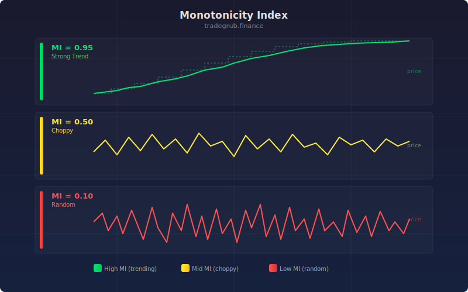

# Monotonicity Index

Measures how orderly or consistent recent price action is by analyzing consecutive price pairs over a rolling window. A perfectly monotonic trend (all pairs moving in the same direction) scores 100, while choppy, directionless price action scores around 50.

## Conceptual Diagram

## Parameters

- **Length:** Rolling window size (default 20, range 5 to 100)

## Signals

- **Score above 80:** Strong, orderly trend in progress (highlighted with background shading)
- **Score near 50:** Random, choppy price action with no clear directional bias
- **Score between 50 and 80:** Moderate trend with some reversals mixed in

## How It Works

For each bar, the indicator looks back over the specified window and counts consecutive pairs of closes:

1. If close[i] <= close[i+1], the pair is "increasing"
2. Otherwise the pair is "decreasing"
3. The score is: max(increasing pairs, decreasing pairs) / total pairs * 100

This approach is inspired by isotonic regression concepts. The result captures trend quality rather than trend direction or magnitude. A slow, steady grind higher scores the same as a fast, steady drop: both are orderly. The indicator helps distinguish clean, tradeable trends from noisy, whipsaw conditions.
