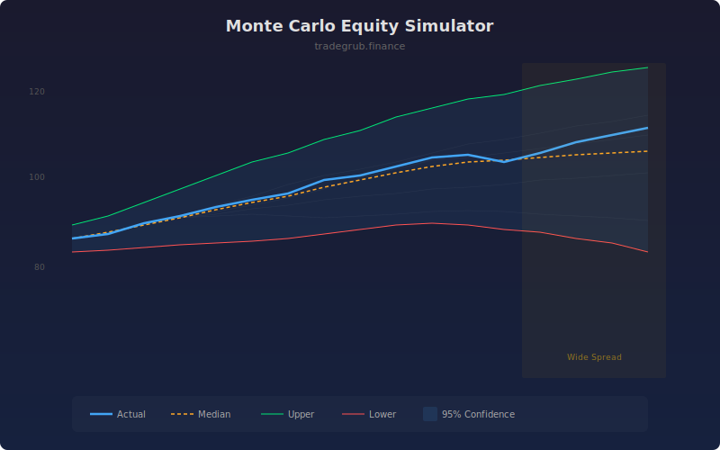

# Monte Carlo Equity Simulator

Simulates hundreds of possible equity paths by randomly resampling historical returns to build confidence intervals around future performance. This helps quantify the range of possible outcomes and assess whether current performance falls within expected bounds.

## How It Works

- Collects bar-over-bar returns over a rolling lookback window
- Randomly resamples these returns to generate many possible forward equity paths
- Calculates confidence intervals from the distribution of simulated final values
- Compares actual equity against the simulated median and bounds
- Highlights periods where the confidence band widens, indicating higher uncertainty

## Parameters

| Parameter | Default | Range | Description |
|-----------|---------|-------|-------------|
| Lookback Period | 50 | 10-200 | Number of bars for return distribution sampling |
| Simulations | 100 | 20-500 | Number of Monte Carlo paths to simulate |
| Confidence % | 95.0 | 50-99 | Confidence interval width |

## Outputs

- **Actual Equity**: Blue line showing realized equity path
- **Median Path**: Orange line showing median of simulated paths
- **Upper Bound**: Green line showing upper confidence limit
- **Lower Bound**: Red line showing lower confidence limit
- **Wide Spread**: Amber background when confidence band is unusually wide

## Usage Notes

- Actual equity near or below the lower bound may signal strategy degradation
- Wider confidence bands indicate more volatile or uncertain return distributions
- Increase simulation count for smoother confidence intervals at the cost of computation time
