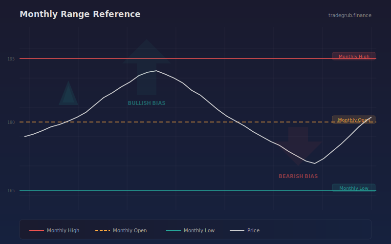

# Monthly Range Reference

Tracks and displays rolling 21-bar monthly high, low, and open reference levels with trend bias using numpy. This support and resistance indicator provides quantitative signals that can be applied to any liquid market across all timeframes.

## Conceptual Diagram



## How It Works

The indicator analyzes price data using support and resistance techniques to produce actionable signals.

Core techniques include iterative computation, extremum detection, high-low range analysis. The computation processes all bars simultaneously using vectorized numpy operations, ensuring consistent results regardless of the dataset size.

Integer parameters control window lengths and thresholds, allowing the indicator to adapt from scalping on short timeframes to position trading on weekly charts. Shorter windows increase sensitivity to recent price action while longer windows provide smoother, more reliable signals.

## Parameters

| Parameter | Default | Range | Description |
|-----------|---------|-------|-------------|
| Monthly Period | 21 | 15 - 30 | Controls monthly period sensitivity (int) |

## Signals

- **Monthly High**: Primary visual output plotted as a continuous line on the chart
- **Monthly Low**: Primary visual output plotted as a continuous line on the chart
- **Monthly Open**: Primary visual output plotted as a continuous line on the chart
- **Monthly Mid**: Primary visual output plotted as a continuous line on the chart
- **Background shading**: Highlights active signal zones based on trend_down.tolist()

## Python Advantage

The entire computation runs as vectorized numpy operations, processing all bars simultaneously rather than one at a time:

```python
hi = np.array(high, dtype=float)
lo = np.array(low, dtype=float)
cl = np.array(close, dtype=float)
n = len(cl)

m_hi = np.zeros(n)
m_lo = np.zeros(n)
m_open = np.zeros(n)
m_mid = np.zeros(n)

for i in range(period, n):
```

Python's numpy arrays allow element-wise arithmetic across thousands of bars in a single expression. Adding custom variations or combining with other calculations is straightforward, requiring only standard array operations.

## When to Use

- Identify key price levels where reversals are likely
- Set profit targets at the next resistance or support level
- Detect breakouts above resistance or breakdowns below support
- Plan entries near support with tight stop-losses below

Works best on daily and intraday charts for liquid instruments. Shorter parameter values suit scalping and day trading while longer values work for swing and position trading.

## Risk Management

No indicator is predictive on its own. Always define risk before entering a trade:

- Set stop-losses based on ATR or recent swing points, not arbitrary percentages
- Size positions so that a stop-loss hit risks no more than 1-2% of account equity
- Avoid adding to losing positions based solely on indicator readings
- Backtest parameter combinations on out-of-sample data before live trading

## Combining with Other Indicators

- **Moving Average Ribbon**: Use the Moving Average Ribbon to confirm the overall trend direction before acting on this indicator's signals. Trading in the direction of the ribbon produces higher win rates.
- **Volume Profile POC**: When this indicator's signal aligns with a high-volume node from the Volume Profile, the confluence creates a stronger setup with better follow-through.
- **RSI or Stochastic**: Add a momentum oscillator as a confirmation filter. Signals that align with oversold or overbought momentum readings tend to produce larger moves.
