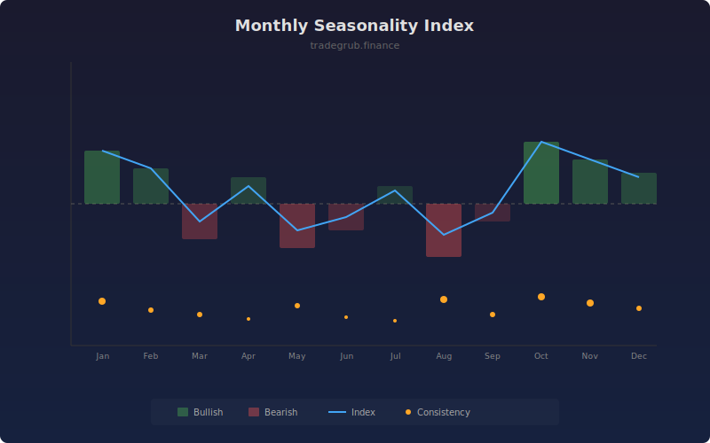

# Monthly Seasonality Index

Analyzes calendar-cycle seasonal patterns by grouping bars into repeating monthly positions and measuring average returns at each position. Reveals which periods within the cycle tend to be bullish or bearish based on historical data.

## How It Works

- Groups bars by their position within a configurable cycle length (default 12)
- Calculates the average return for each cycle position over the lookback period
- Measures consistency as the imbalance between positive and negative returns
- Applies optional smoothing to reduce noise in the seasonal signal
- Highlights bullish and bearish seasonal periods with background shading

## Parameters

| Parameter | Default | Range | Description |
|-----------|---------|-------|-------------|
| Cycle Length | 12 | 4-52 | Bars per seasonal cycle |
| Lookback Bars | 120 | 24-600 | Historical bars to analyze |
| Smoothing | 3 | 1-10 | Moving average smoothing for the index |

## Outputs

- **Seasonal Index**: Average return for the current cycle position
- **Consistency %**: How consistently the pattern has held historically
- **Background**: Green for bullish seasonal periods, red for bearish

## Usage Notes

- On monthly charts, cycle length 12 captures annual seasonal patterns
- Higher consistency percentages indicate more reliable seasonal edges
- Seasonality should be one factor among many, not a standalone signal
