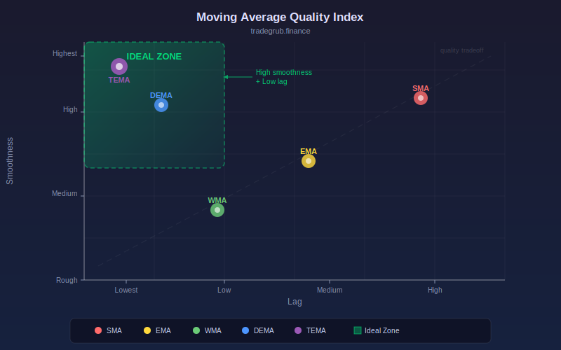

# Moving Average Quality Index

Benchmarks multiple moving average types on smoothness vs lag tradeoff using numpy signal quality metrics. This statistical analysis indicator provides quantitative signals that can be applied to any liquid market across all timeframes.

## Conceptual Diagram



## How It Works

The indicator analyzes price data using statistical analysis techniques to produce actionable signals.

Built-in technical functions used: `ema, sma`. These provide the foundation for the indicator's calculations, computed efficiently across the full price history in a single pass.

Core techniques include exponential moving average, simple moving average, iterative computation, standard deviation analysis. The computation processes all bars simultaneously using vectorized numpy operations, ensuring consistent results regardless of the dataset size.

Integer parameters control window lengths and thresholds, allowing the indicator to adapt from scalping on short timeframes to position trading on weekly charts. Shorter windows increase sensitivity to recent price action while longer windows provide smoother, more reliable signals.

## Parameters

| Parameter | Default | Range | Description |
|-----------|---------|-------|-------------|
| MA Length | 20 | 5 - 100 | Controls ma length sensitivity (int) |

## Signals

- **SMA Smoothness**: Primary visual output plotted as a continuous line on the chart
- **EMA Smoothness**: Primary visual output plotted as a continuous line on the chart
- **DEMA Smoothness**: Primary visual output plotted as a continuous line on the chart
- **Mid Quality** (50): Reference level for threshold-based decisions

## Python Advantage

The entire computation runs as vectorized numpy operations, processing all bars simultaneously rather than one at a time:

```python
sma = np.array(ta.sma(close, length), dtype=float)
ema = np.array(ta.ema(close, length), dtype=float)
sma = np.nan_to_num(sma, nan=0.0)
ema = np.nan_to_num(ema, nan=0.0)

dema = 2 * ema - np.array(ta.ema(ema.tolist(), length), dtype=float)
dema = np.nan_to_num(dema, nan=0.0)

def measure_smoothness(ma_vals, window=20):
    smoothness = np.zeros(n)
    for i in range(window, n):
```

Python's numpy arrays allow element-wise arithmetic across thousands of bars in a single expression. Adding custom variations or combining with other calculations is straightforward, requiring only standard array operations.

## When to Use

- Quantify price behavior with statistical measures
- Identify when price deviates significantly from statistical norms
- Build probabilistic models for price movement expectations
- Detect regime changes through statistical anomalies

Works best on daily and intraday charts for liquid instruments. Shorter parameter values suit scalping and day trading while longer values work for swing and position trading.

## Risk Management

No indicator is predictive on its own. Always define risk before entering a trade:

- Set stop-losses based on ATR or recent swing points, not arbitrary percentages
- Size positions so that a stop-loss hit risks no more than 1-2% of account equity
- Avoid adding to losing positions based solely on indicator readings
- Backtest parameter combinations on out-of-sample data before live trading

## Combining with Other Indicators

- **Moving Average Ribbon**: Use the Moving Average Ribbon to confirm the overall trend direction before acting on this indicator's signals. Trading in the direction of the ribbon produces higher win rates.
- **Volume Profile POC**: When this indicator's signal aligns with a high-volume node from the Volume Profile, the confluence creates a stronger setup with better follow-through.
- **RSI or Stochastic**: Add a momentum oscillator as a confirmation filter. Signals that align with oversold or overbought momentum readings tend to produce larger moves.
