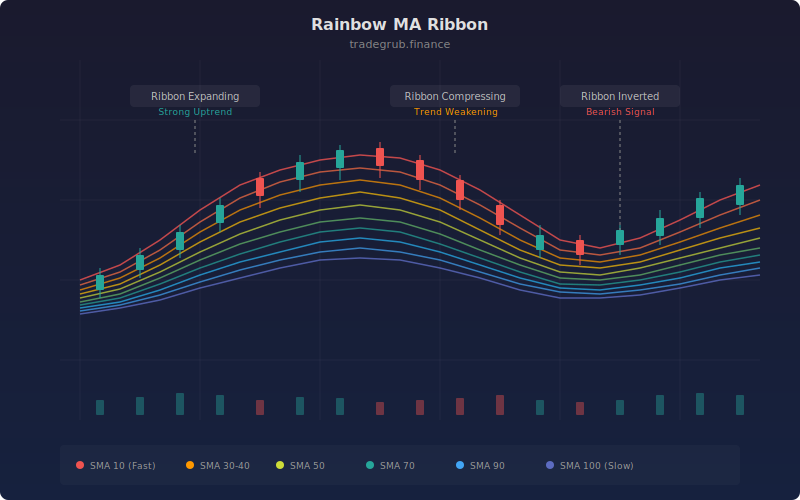

# Rainbow MA Ribbon

The Rainbow MA Ribbon displays ten simple moving averages from SMA 10 to SMA 100 in steps of 10, colored in a spectral gradient from red (fastest) through amber and green to blue (slowest) with translucent fills between each adjacent pair. This technique provides a comprehensive, multi-timeframe view of trend alignment in a single glance, showing whether short, medium, and long-term momentum agree or diverge.

## Conceptual Diagram



## How It Works

Ten simple moving averages are computed at evenly spaced periods from 10 to 100 bars. Each SMA captures a different slice of the trend spectrum: SMA 10 reflects the most recent 2 weeks of daily price action, while SMA 100 captures roughly 5 months of trend history. Together, they paint a complete picture of momentum at every timescale.

The ribbon's ordering reveals trend direction. When all ten SMAs are stacked in ascending order (SMA 10 on top, SMA 100 on bottom), a strong uptrend is in place. The inverse stacking confirms a downtrend. When the lines are interleaved or tangled, the market lacks a clear directional bias.

The ribbon's width carries information about trend strength and conviction. A wide, fanned-out ribbon means short-term and long-term averages are far apart, indicating strong sustained momentum. When the ribbon compresses into a tight cluster, it signals that momentum across all timeframes is converging, often preceding a breakout or major trend change.

Each adjacent pair of SMAs is filled with a translucent color matching the faster SMA, creating nine colored bands. The visual effect is a rainbow that expands during trends and contracts during consolidations. The color gradient provides instant orientation: red tones are the leading edge of the ribbon, blue tones are the trailing edge.

## Parameters

| Parameter | Default | Range | Description |
|-----------|---------|-------|-------------|
| SMA 10 | 10 | Fixed | Fastest SMA in the ribbon (red) |
| SMA 20 | 20 | Fixed | Second layer (orange) |
| SMA 30 | 30 | Fixed | Third layer (amber) |
| SMA 40 | 40 | Fixed | Fourth layer (yellow) |
| SMA 50 | 50 | Fixed | Fifth layer (lime) |
| SMA 60 | 60 | Fixed | Sixth layer (light green) |
| SMA 70 | 70 | Fixed | Seventh layer (green) |
| SMA 80 | 80 | Fixed | Eighth layer (teal) |
| SMA 90 | 90 | Fixed | Ninth layer (cyan) |
| SMA 100 | 100 | Fixed | Slowest SMA in the ribbon (blue) |

## Python Advantage

All ten SMAs are computed as independent vectorized operations, and the color assignments use a Python list for clean iteration over the gradient:

```python
# Color gradient defined as a Python list
colors = [
    "rgba(244,67,54,0.9)",   # red
    "rgba(255,87,34,0.9)",   # deep orange
    "rgba(255,152,0,0.9)",   # orange
    "rgba(255,193,7,0.9)",   # amber
    "rgba(205,220,57,0.9)",  # lime
    "rgba(139,195,74,0.9)",  # light green
    "rgba(76,175,80,0.9)",   # green
    "rgba(0,150,136,0.9)",   # teal
    "rgba(0,188,212,0.9)",   # cyan
    "rgba(33,150,243,0.9)",  # blue
]

# Ten SMAs computed as full-array vectorized operations
sma10 = ta.sma(close, 10)
sma20 = ta.sma(close, 20)
# ... through sma100

# Python extension: generate dynamically from any period list
# periods = list(range(10, 110, 10))
# smas = [ta.sma(close, p) for p in periods]
```

The list comprehension `[ta.sma(close, p) for p in periods]` would generate any number of SMAs from an arbitrary period list in a single line, something impossible in Pine where each SMA and its plot must be hardcoded. You could also compute ribbon width as `smas[0] - smas[-1]` for a quantitative spread metric, or use `all(smas[i] > smas[i+1] for i in range(len(smas)-1))` to detect perfectly ordered ribbons.

## When to Use

The Rainbow MA Ribbon excels on daily charts for swing and position trading across all liquid asset classes. It provides the broadest view of trend alignment available in a single indicator. Use it during trending markets to confirm momentum and identify the depth of trend support. During range-bound markets, the compressed ribbon warns against trend-following entries.

## Risk Management

Enter trades when the ribbon is fanning out in your direction and exit or tighten stops when it compresses. Place stops beyond the outermost SMA (100-period) for position trades, or beyond the SMA 50 for swing trades. The large number of SMAs means the ribbon is slow to fully reverse, so be patient during transitions. Avoid trading during ribbon tangles where the lines are crossing repeatedly, as whipsaw risk is highest.

## Combining with Other Indicators

- **EMA Ribbon**: Compare the SMA Rainbow Ribbon (smoother, more lag) with the EMA Ribbon (faster, Fibonacci-spaced) to see where exponential and simple averages agree on trend direction.
- **Trend Strength**: Use the Trend Strength composite score to quantify what the ribbon shows visually, confirming whether a fanned ribbon reflects genuine multi-factor trend conviction.
- **ATR Percent**: Size positions based on ATR Percent when the ribbon confirms a new trend, ensuring risk-appropriate allocation relative to current volatility.
