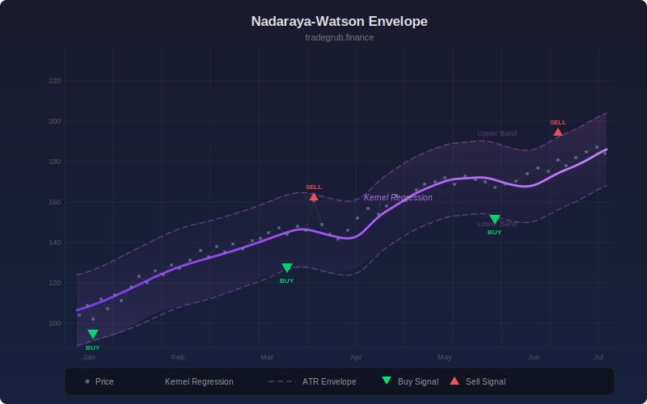

# Nadaraya-Watson Envelope

Non-parametric kernel regression price channel using a Gaussian kernel with ATR-based envelopes. Fits a smooth curve to recent price action without assuming a fixed functional form, then wraps it with upper and lower bands to identify overbought and oversold conditions.

## Conceptual Diagram

## Parameters

- **Bandwidth** (default 8): Controls the width of the Gaussian kernel. Lower values produce a curve that follows price more closely. Higher values produce a smoother curve.
- **Window** (default 50): Number of past bars used in the regression calculation.
- **Envelope Multiplier** (default 2.0): Multiplied by ATR to set the distance of the upper and lower envelopes from the regression line.
- **ATR Length** (default 14): Period for the Average True Range used to size the envelopes.

## Signals

- **Overbought (red triangle above bar):** Price crosses above the upper envelope, suggesting extended price action to the upside.
- **Oversold (green triangle below bar):** Price crosses below the lower envelope, suggesting extended price action to the downside.

## How It Works

1. For each bar, a weighted average of nearby closing prices is computed using a Gaussian kernel. Bars closer in time receive higher weight, bars further away receive lower weight. The bandwidth parameter controls how quickly weights decay with distance.
2. The resulting regression line represents a smoothed estimate of the underlying price trend.
3. Upper and lower envelopes are placed at a fixed ATR multiple above and below the regression line, creating a dynamic channel that adapts to volatility.
4. When price crosses outside the envelopes, it signals a potential overextension that may revert toward the mean.
