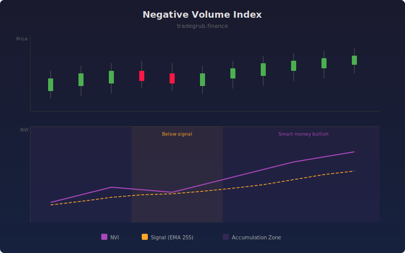

# Negative Volume Index

The Negative Volume Index (NVI) accumulates price changes only on days when volume decreases from the prior bar. The theory is that smart money operates on quiet, low-volume days while the crowd dominates high-volume sessions. NVI above its signal line suggests smart money is bullish.

## How It Works

- Starts at a base value of 1000
- On bars where volume decreases from the prior bar, NVI adjusts by the percentage price change
- On bars where volume increases or stays flat, NVI carries forward unchanged
- A long-term EMA signal line provides trend context
- NVI above signal indicates smart money accumulation; below indicates distribution

## Parameters

| Parameter | Default | Range | Description |
|-----------|---------|-------|-------------|
| Signal Length | 255 | 10-500 | EMA period for the signal line |
| Show Signal Line | true | - | Display the EMA signal overlay |

## Outputs

- **NVI**: The cumulative negative volume index line
- **Signal**: EMA of NVI for trend filtering
- **Background**: Purple tint when NVI is above signal, orange tint when below

## Usage Notes

- NVI above its signal line has historically indicated a bull market roughly 96% of the time
- Best paired with the Positive Volume Index for a complete smart money vs crowd analysis
- Rising NVI during a downtrend can signal hidden accumulation before a reversal
