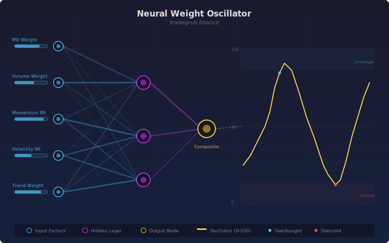

# Neural Weight Oscillator

Self-weighting multi-factor oscillator that dynamically adjusts the contribution of trend, momentum, and mean-reversion sub-scores based on their recent predictive accuracy.

## Conceptual Diagram

## Parameters

| Parameter | Type | Default | Range | Description |
|-----------|------|---------|-------|-------------|
| Lookback | int | 20 | 5-100 | Period for sub-score calculations |
| Weight Period | int | 50 | 10-200 | Rolling window for accuracy measurement |

## Signals

- Values above 0.5: strong bullish composite signal
- Values below -0.5: strong bearish composite signal
- Zero-line crossovers indicate directional shifts
- Background highlights extreme readings

## Usage

The oscillator combines three factors (trend slope, RSI momentum, price z-score) and weights each by its rolling correlation with next-bar returns. Factors that have been more predictive recently receive higher weight. Use as a confirmation tool alongside price action.
