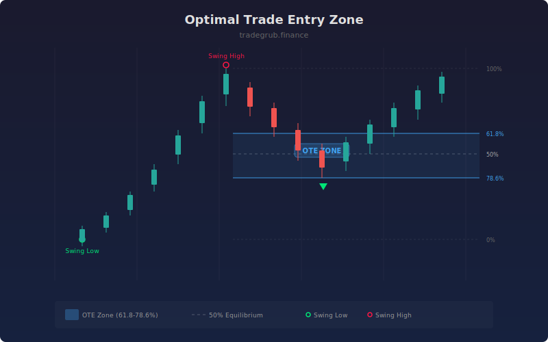

# Optimal Trade Entry Zone

Projects Fibonacci-based entry zones between the 61.8% and 78.6% retracement levels within identified structural moves. This zone, known as the Optimal Trade Entry (OTE), represents the area where retracements are most likely to reverse and resume the trend direction.

## How It Works

- Identifies swing highs and swing lows using a configurable lookback period.
- Pairs the most recent swing low and swing high to define a structural move.
- Calculates the 61.8% and 78.6% retracement levels between the swing endpoints.
- Plots the OTE zone boundaries and a 50% equilibrium reference line.
- Highlights bars where price enters the OTE zone with background shading and shape markers.

## Parameters

| Parameter | Default | Range | Description |
|-----------|---------|-------|-------------|
| Swing Lookback | 10 | 3-50 | Bars to identify swing points |
| Upper Fib Level | 0.618 | 0.5-0.9 | Upper boundary of the OTE zone |
| Lower Fib Level | 0.786 | 0.6-1.0 | Lower boundary of the OTE zone |
| Show OTE Zone | true | on/off | Display the OTE zone boundary lines |
| Show Fib Levels | true | on/off | Display the 50% equilibrium line |

## Outputs

- **OTE Upper**: Upper boundary of the entry zone
- **OTE Lower**: Lower boundary of the entry zone
- **50% Fib**: Equilibrium reference line
- **Signals**: Triangles when price enters bullish or bearish OTE zones

## Usage Notes

- In a bullish structure (swing low then swing high), look for long entries when price pulls back into the OTE zone.
- In a bearish structure (swing high then swing low), look for short entries on rallies into the OTE zone.
- The OTE zone works best when combined with a confirmed market structure shift or displacement signal.
