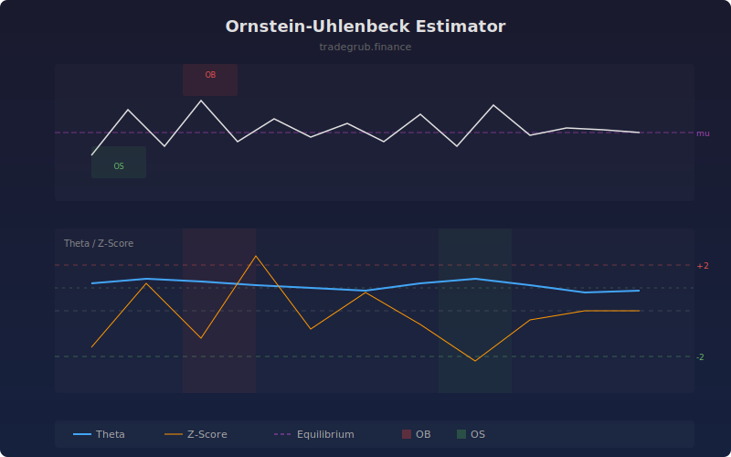

# Ornstein-Uhlenbeck Estimator

The Ornstein-Uhlenbeck Estimator fits the classic stochastic mean-reversion model to rolling price windows, extracting three key parameters: the speed of mean reversion (theta), the equilibrium price level (mu), and the process volatility (sigma). These parameters provide a rigorous statistical framework for identifying and trading mean-reverting behavior.

## How It Works

- Regresses each price observation on its prior value (AR(1) model)
- Extracts the OU parameters: theta (speed), mu (equilibrium), sigma (volatility)
- Calculates a z-score measuring deviation from equilibrium in units of equilibrium standard deviation
- Higher theta values indicate stronger mean-reverting forces
- Extreme z-scores flag overbought or oversold conditions relative to the fitted equilibrium

## Parameters

| Parameter | Default | Range | Description |
|-----------|---------|-------|-------------|
| Lookback Length | 60 | 20-300 | Window for parameter estimation |
| Show Equilibrium Level | true | - | Display the equilibrium mu level |

## Outputs

- **Mean-Rev Speed**: Theta parameter measuring reversion strength (blue line)
- **Z-Score**: Distance from equilibrium in standard deviations (orange line)
- **Background**: Red for overbought (z > 2), green for oversold (z < -2)

## Usage Notes

- Theta above 0.5 suggests statistically significant mean reversion in the window
- Z-scores beyond plus or minus 2 represent potential entry points for reversion trades
- When theta is near zero, the series behaves like a random walk and reversion trades are risky
