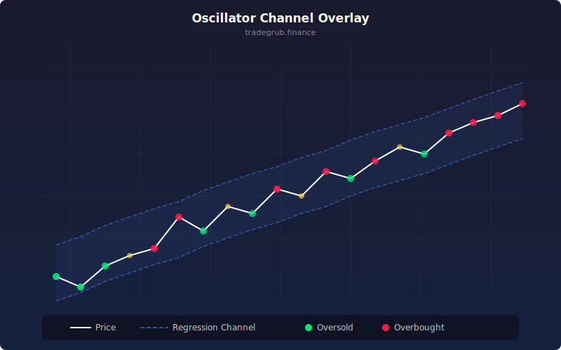

# Oscillator Channel Overlay

Maps RSI values into a linear regression channel directly on the price chart, showing oscillator state in price context rather than a separate pane.

## How It Works

- Fits a rolling linear regression to close prices using numpy lstsq
- Creates a channel around the regression line using ATR-based width
- Maps RSI value to a position within the channel: RSI 50 sits on the regression line, RSI 70 maps above, RSI 30 maps below
- The result shows overbought/oversold conditions relative to the current trend

## Parameters

| Parameter      | Default | Range  | Description                          |
|----------------|---------|--------|--------------------------------------|
| Regression Length | 50   | 10-200 | Rolling window for linear regression |
| RSI Length      | 14     | 2-50   | Period for RSI calculation           |

## Signals

- **Green RSI line**: RSI above 60, bullish momentum within the channel
- **Red RSI line**: RSI below 40, bearish momentum within the channel
- **Orange RSI line**: RSI neutral (40-60)
- **Gray regression line**: Current trend direction
- RSI line near channel edges indicates extreme overbought/oversold in trend context

## Usage Notes

- When RSI-mapped line hugs the upper channel, momentum supports the trend
- RSI-mapped line crossing the regression line signals momentum shifts
- Channel width adapts to volatility via ATR scaling
