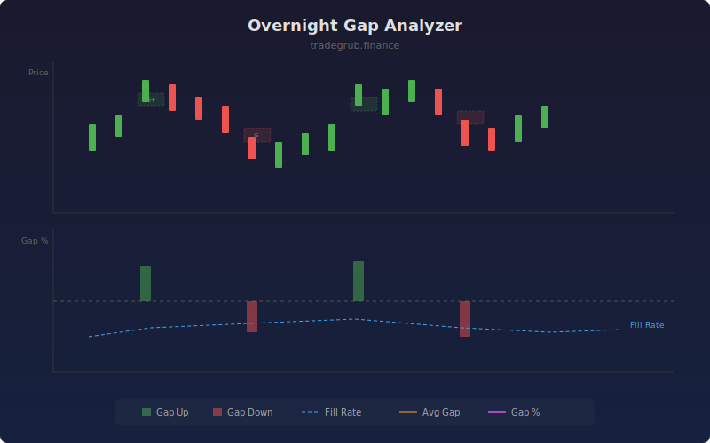

# Overnight Gap Analyzer

Analyzes gaps between the previous close and current open, tracking gap size, fill rate, and directional statistics. Provides a statistical profile of gap behavior to inform opening-range strategies.

## How It Works

- Detects gaps where the open differs from prior close by more than the threshold percentage
- Classifies gaps as up or down and tracks whether they fill within 20 bars
- Calculates rolling fill rate as the percentage of gaps that get filled in the lookback
- Measures average gap size to identify expanding or contracting gap activity
- Labels individual gaps on the chart for quick visual identification

## Parameters

| Parameter | Default | Range | Description |
|-----------|---------|-------|-------------|
| Min Gap % | 0.3 | 0.05-5.0 | Minimum gap size to qualify as significant |
| Lookback Bars | 50 | 10-200 | Rolling window for fill rate calculation |
| Show Gap Labels | true | - | Display G+ and G- labels at gap bars |

## Outputs

- **Gap %**: Size and direction of each gap as a percentage
- **Fill Rate %**: Rolling percentage of gaps that filled within 20 bars
- **Avg Gap Size %**: Average absolute gap size in the lookback window
- **Labels**: G+ for gap up, G- for gap down

## Usage Notes

- High fill rates (above 70%) suggest fading gaps is a viable strategy
- Large gaps with low fill rates may indicate breakaway gaps with trend continuation
- Reduce the threshold for lower-volatility instruments to capture smaller gaps
