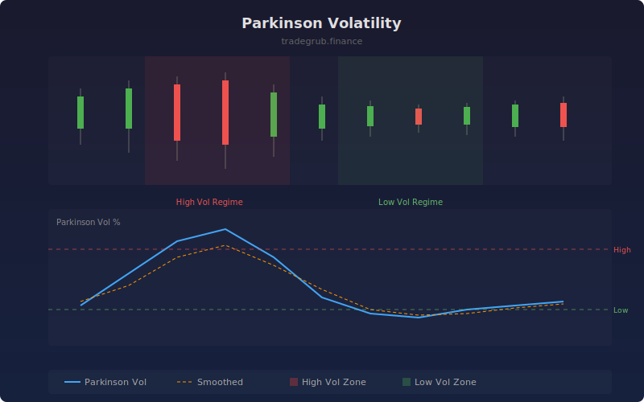

# Parkinson Volatility

The Parkinson volatility estimator uses the high-low price range to calculate a more efficient measure of variance than close-to-close methods. By leveraging intraday extremes, this estimator captures up to five times more information per observation, making it particularly useful for markets with significant intraday movement.

## How It Works

- Computes the natural log ratio of high to low prices for each bar
- Applies the Parkinson scaling factor (1 / 4 ln 2) to the rolling mean of squared log ratios
- Annualizes the result and expresses it as a percentage
- Highlights high and low volatility regimes based on percentile thresholds
- Optionally overlays a smoothed moving average for trend identification

## Parameters

| Parameter | Default | Range | Description |
|-----------|---------|-------|-------------|
| Length | 20 | 5-200 | Rolling window for volatility calculation |
| Annualization Factor | 252 | 1-365 | Trading days per year for annualization |
| Show Smoothed Line | true | - | Display SMA overlay on volatility |
| Smooth Length | 10 | 2-50 | Period for the smoothing average |

## Outputs

- **Parkinson Vol**: Main volatility estimate (blue line)
- **Smoothed**: Simple moving average of volatility (orange line)
- **Background**: Red shading for high volatility, green for low volatility regimes

## Usage Notes

- Compare with close-to-close volatility to detect hidden intraday activity
- Rising Parkinson volatility with flat close-to-close volatility suggests intraday whipsaws
- Use low volatility zones to anticipate potential breakout setups
