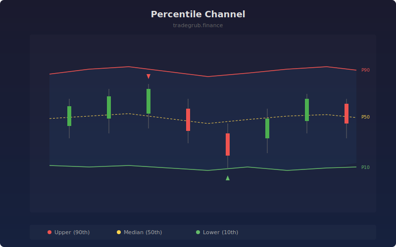

# Percentile Channel

Creates adaptive support and resistance bands using rolling percentile calculations. Unlike fixed-deviation bands, percentile channels naturally adjust to the actual distribution of price data, making them more robust during non-normal market conditions.

## How It Works

- Computes rolling percentile values over a configurable lookback window
- Upper band represents the high percentile (default 90th) acting as dynamic resistance
- Lower band represents the low percentile (default 10th) acting as dynamic support
- Mid band shows the median (50th percentile) as the equilibrium level
- Calculates the current bar's percentile rank within the window to identify extremes

## Parameters

| Parameter | Default | Range | Description |
|-----------|---------|-------|-------------|
| Channel Length | 50 | 10-200 | Rolling window for percentile calculation |
| Upper Percentile | 90.0 | 60-99 | Percentile level for upper band |
| Lower Percentile | 10.0 | 1-40 | Percentile level for lower band |
| Mid Percentile | 50.0 | 25-75 | Percentile level for middle band |

## Outputs

- **Upper Band**: Dynamic resistance at the upper percentile level
- **Mid Band**: Equilibrium line at the median percentile
- **Lower Band**: Dynamic support at the lower percentile level
- **Touch Signals**: Markers when price reaches extreme percentile zones

## Usage Notes

- Wider percentile spread (95/5) captures more of the range for longer-term levels
- Narrower percentile spread (75/25) provides tighter bands for active trading
- Price consistently above the mid band suggests bullish bias and vice versa
