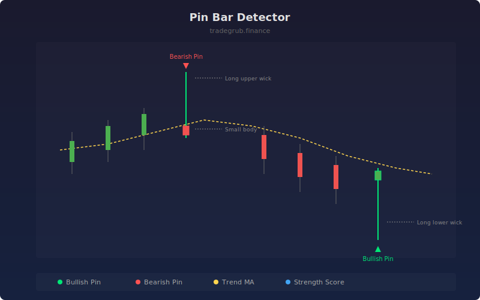

# Pin Bar Detector

Detects pin bar (pinocchio bar) candlestick patterns characterized by a long rejection wick and small body. These candles signal price rejection at a level and often precede reversals, especially when appearing at trend extremes.

## How It Works

- Measures the ratio of the dominant wick length to the body size for each candle
- Requires the opposite wick to be small relative to total range (clean rejection)
- Filters out weak candles by requiring minimum range relative to ATR
- Uses a trend MA to validate context: bullish pins below MA, bearish pins above MA
- Calculates a strength score based on wick length normalized by ATR

## Parameters

| Parameter | Default | Range | Description |
|-----------|---------|-------|-------------|
| Min Wick to Body Ratio | 2.5 | 1.5-5.0 | Minimum ratio of long wick to body size |
| Max Small Wick % | 0.2 | 0.05-0.5 | Maximum opposite wick as fraction of range |
| Min Range vs ATR | 0.8 | 0.3-2.0 | Minimum candle range relative to ATR |
| ATR Length | 14 | 5-50 | ATR calculation period |
| Trend MA Length | 20 | 5-100 | Moving average for trend context |

## Outputs

- **Bullish Pin Bar**: Green triangles below bars with long lower wicks
- **Bearish Pin Bar**: Red triangles above bars with long upper wicks
- **Pin Strength**: Normalized wick length score
- **Trend MA**: Moving average for directional context

## Usage Notes

- Pin bars at support/resistance levels or round numbers carry more weight
- Higher strength scores indicate more decisive rejection and higher probability
- Look for confirmation on the following bar before entering a trade
