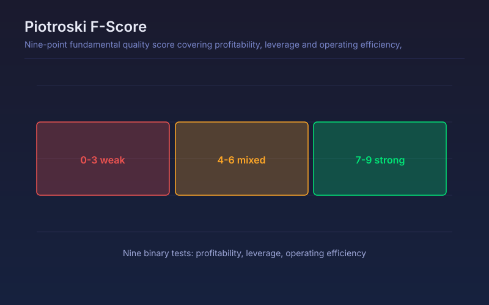

# Piotroski F-Score

Nine-point fundamental quality score covering profitability, leverage and operating efficiency, plotted as a bar-aligned series.

## Conceptual Diagram

## Parameters

| Parameter | Default | Range | Description |
|-----------|---------|-------|-------------|
| Reporting period | FY | FY or FQ | Annual or quarterly statements used for every test |

## Signals

- Score of 8 or 9: strong and improving fundamentals, the classic Piotroski long candidate
- Score of 4 to 6: mixed picture, no clear fundamental edge in either direction
- Score of 0 to 3: weak fundamentals, the short side of the original study
- A score that steps down at a new filing marks deteriorating quality before price usually reflects it

## Usage

Use as a fundamental quality filter before applying any technical setup, and watch the step changes at each filing date. The score only updates when a new statement is filed, so it is flat between reports by design.

## Data Requirements

This script reads filed financial statements through `request.financial()`, so it
needs fundamental data for the charted symbol. On instruments without filed
statements, such as crypto pairs, forex and most indices, the series is empty and
nothing plots. Values step only at each filing date and stay flat in between.
