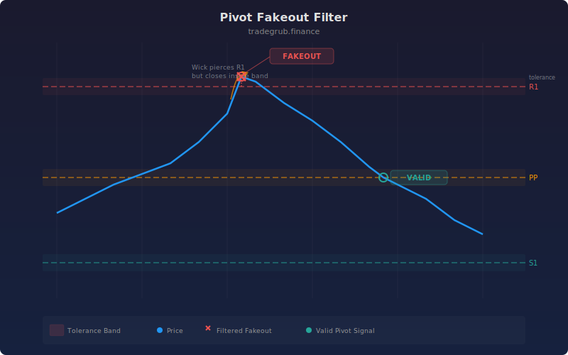

## Pivot Fakeout Filter

Daily pivot points (PP, R1, R2, R3, S1, S2, S3) with percentage-based tolerance bands around each level. A breakout is only confirmed when price closes beyond the tolerance zone, filtering out false breakouts and fakeouts. Resistance zones are color-coded red and support zones green.

### Parameters

- **Pivot Period**: Lookback period for calculating the previous high, low, and close (default: 20)
- **Fakeout Tolerance %**: Percentage buffer around each pivot level (default: 0.3)
- **Show Tolerance Zones**: Toggle shaded tolerance bands on or off (default: true)

### How It Works

1. Standard pivot point formula calculates PP, R1/R2/R3, and S1/S2/S3 from the prior period high, low, and close
2. A tolerance band is added above and below each level using the fakeout percentage
3. Price must close beyond the outer edge of the band to confirm a breakout
4. Confirmed bullish breakouts show a green triangle below the bar
5. Confirmed bearish breakdowns show a red triangle above the bar

### Signals

- **Green triangle below bar**: Price closed above R1 tolerance band, confirming bullish breakout
- **Red triangle above bar**: Price closed below S1 tolerance band, confirming bearish breakdown
- **Shaded zones**: Visual tolerance bands around each pivot level

## Conceptual Diagram

