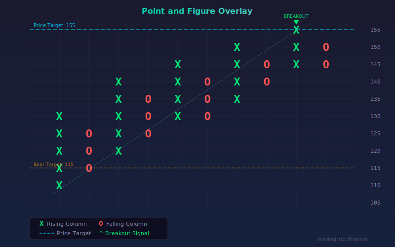

# Point and Figure Overlay

A classic Point and Figure (P&F) charting method rendered as an overlay on standard candlestick charts. This indicator builds X and O columns directly from price action, filtering out noise and highlighting significant trend moves and reversals.

## Conceptual Diagram



## How It Works

Point and Figure charts ignore time and focus purely on price movement:

1. **Box Construction:** Price is divided into fixed-size boxes. Each box represents a specific price increment. Boxes can be sized using a fixed value or derived automatically from ATR for adaptive scaling.

2. **X Columns (Rising):** When price rises by at least one box size, an X is added to the current column. X columns represent upward price movement and are plotted in green.

3. **O Columns (Falling):** When price falls by at least one box size, an O is added to the current column. O columns represent downward price movement and are plotted in red.

4. **Reversal Rule:** A new column is started only when price reverses by the reversal amount (reversal_boxes x box_size). This filtering mechanism removes minor fluctuations and keeps the chart focused on meaningful moves.

5. **Price Targets:** Horizontal count targets are calculated from completed columns. The width of a column (in boxes) is projected forward to estimate potential price objectives.

## Parameters

| Parameter | Default | Range | Description |
|-----------|---------|-------|-------------|
| Box Size Mode | ATR | ATR, Fixed | How box size is determined: ATR adapts to volatility, Fixed uses a constant value |
| Box Size (Fixed) | 1.0 | 0.01+ | The fixed box size in price units (used when mode is Fixed) |
| ATR Length | 14 | 5 to 50 | Lookback period for ATR calculation (used when mode is ATR) |
| Reversal Boxes | 3 | 1 to 5 | Number of boxes price must move against the current direction to trigger a column reversal |
| Display Columns | 20 | 5 to 50 | Maximum number of P&F columns shown on the chart |

## Signals

**Double Top Breakout:** When an X column exceeds the high of the previous X column, a bullish breakout signal appears (green caret). This pattern indicates buyers have pushed through prior resistance.

**Double Bottom Breakdown:** When an O column falls below the low of the previous O column, a bearish breakdown signal appears (red caret). This pattern indicates sellers have broken through prior support.

**Horizontal Count Price Targets:**
- Bullish target (cyan dashed line): Projected from the last completed X column width
- Bearish target (orange dashed line): Projected from the last completed O column width

These targets estimate how far price may travel based on the size of the consolidation pattern.

## Python Advantage

Python enables clean column-tracking logic that would be cumbersome in formula-based languages:

```python
# Track columns as structured data
columns = []
for i in range(1, n):
    if current_dir == 1:
        new_top = snap_up(h, bs)
        if new_top > col_top:
            col_top = new_top
        drop = col_top - snap_down(l, bs)
        if drop >= reversal_dist:
            columns.append((current_dir, col_bottom, col_top, col_start))
            current_dir = -1
```

Maintaining a list of column objects with direction, bounds, and bar index is natural in Python and allows straightforward signal detection and target calculation.

## When to Use

- **Trending markets:** P&F charts excel at identifying and following trends by filtering noise
- **Support and resistance:** Column tops and bottoms naturally mark key price levels
- **Breakout confirmation:** Double top/bottom signals provide clear, objective entry criteria
- **Long-term analysis:** Use larger box sizes or higher reversal counts for position trading
- **Volatile instruments:** ATR mode automatically adjusts box size to match current volatility

## Risk Management

- P&F signals are lagging by nature: a reversal requires multiple boxes of adverse movement before it registers
- Tight box sizes generate more columns but also more false signals
- Always confirm P&F breakouts with volume or momentum before entering trades
- Price targets are projections, not guarantees: use them as guideposts alongside stop losses
- In low-volatility, range-bound markets, P&F charts may produce few actionable signals

## Combining With Other Indicators

- **Volume indicators:** Confirm breakout signals with above-average volume
- **Moving averages:** Use a long-term moving average as a trend filter: only take X-column breakouts above the average
- **RSI or momentum oscillators:** Verify that momentum supports the P&F signal direction
- **ATR:** Already built in for adaptive box sizing, but a separate ATR plot can help gauge volatility regime changes
