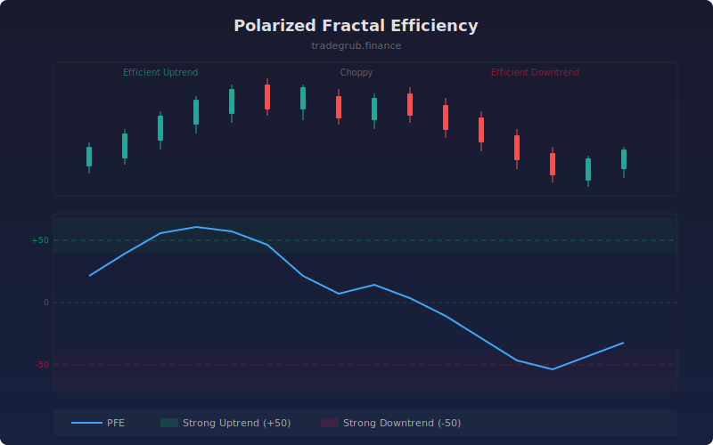

# Polarized Fractal Efficiency

Measures the trending efficiency of price movement using fractal geometry concepts. It compares the straight-line distance price has traveled over a period to the total path length of individual bar moves. Values near +100 indicate efficient uptrends, near -100 indicate efficient downtrends, and near zero indicate choppy, inefficient movement.

## How It Works

- Calculates the straight-line (net) distance from the price N bars ago to current price
- Sums the individual bar-to-bar distances to get the total path length
- Efficiency is the ratio of straight-line distance to path length, scaled to percentage
- The sign is determined by the direction of the net price change
- An EMA smoothing pass reduces noise in the raw efficiency values

## Parameters

| Parameter | Default | Range | Description |
|-----------|---------|-------|-------------|
| Length | 10 | 2-100 | Lookback period for efficiency calculation |
| Smoothing | 5 | 1-20 | EMA smoothing period for the raw PFE |

## Outputs

- **PFE (blue)**: The polarized fractal efficiency oscillator
- **+50/-50 levels**: Thresholds for strong trending conditions
- **Background**: Green shading above +50, red shading below -50

## Usage Notes

- PFE above +50 indicates a strong, efficient uptrend worth riding
- PFE below -50 indicates a strong, efficient downtrend
- Values oscillating near zero suggest range-bound or choppy conditions where trend strategies underperform
