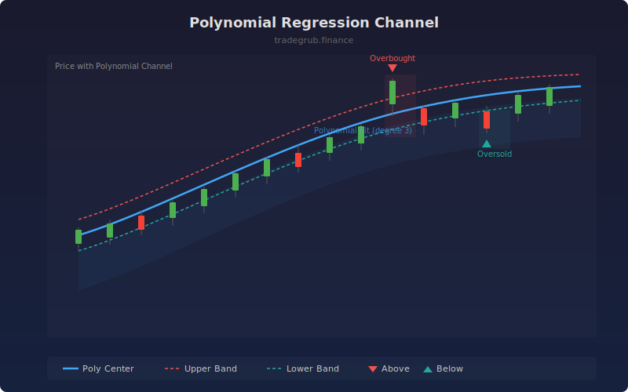

# Polynomial Regression Channel

Fits a polynomial curve of configurable degree to price over a rolling window, then adds standard deviation bands to create a non-linear trend channel. Unlike linear regression channels, polynomial fitting captures curves and inflection points in price trends.

## How It Works

- Fits a polynomial of the specified degree to the closing price over the lookback window using least squares
- Calculates the standard deviation of residuals (price minus fitted values)
- Plots the fitted curve as the channel center with upper and lower bands at the configured standard deviation multiple
- Marks bars where price breaks above or below the channel with triangle markers
- Recalculates the fit on each bar using the most recent lookback window

## Parameters

| Parameter | Default | Range | Description |
|-----------|---------|-------|-------------|
| Lookback Length | 50 | 20-200 | Rolling window for polynomial fitting |
| Polynomial Degree | 3 | 1-5 | Degree of polynomial (1=linear, 2=quadratic, 3=cubic) |
| Channel Width | 2.0 | 0.5-4.0 | Standard deviation multiplier for band width |

## Outputs

- **Poly Center**: Fitted polynomial curve (blue line)
- **Upper Band**: Center plus standard deviation bands (red line)
- **Lower Band**: Center minus standard deviation bands (green line)
- **Triangle Markers**: Red down triangles above channel, green up triangles below channel
- **Background**: Red shading when price above channel, green when below

## Usage Notes

- Degree 2 (quadratic) works well for detecting acceleration and deceleration in trends
- Degree 3 (cubic) captures S-curve patterns and inflection points
- Price touching the lower band in an upward-curving channel can indicate a buying opportunity
