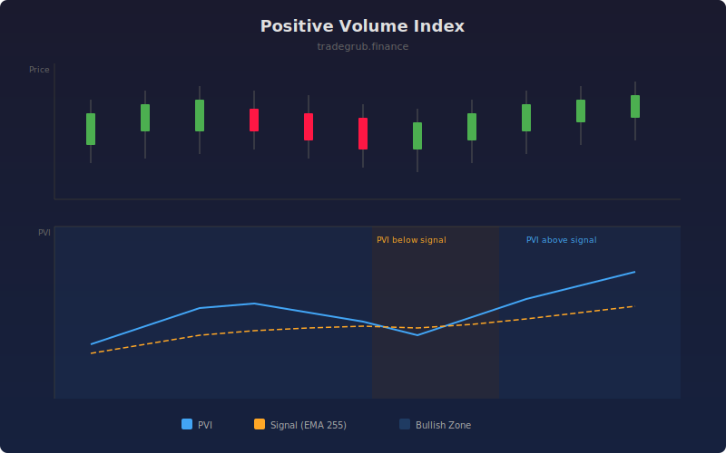

# Positive Volume Index

The Positive Volume Index (PVI) tracks cumulative price changes only on days when volume increases from the prior bar. The theory is that uninformed crowd traders dominate on high-volume days, so PVI reflects crowd sentiment. When PVI is above its signal line, the crowd is bullish.

## How It Works

- Starts at a base value of 1000
- On bars where volume increases from the prior bar, PVI adjusts by the percentage price change
- On bars where volume decreases or stays flat, PVI carries forward unchanged
- A long-term EMA signal line smooths the index for trend detection
- PVI above signal suggests bullish crowd sentiment; below suggests bearish

## Parameters

| Parameter | Default | Range | Description |
|-----------|---------|-------|-------------|
| Signal Length | 255 | 10-500 | EMA period for the signal line |
| Show Signal Line | true | - | Display the EMA signal overlay |

## Outputs

- **PVI**: The cumulative positive volume index line
- **Signal**: EMA of PVI for trend filtering
- **Background**: Blue tint when PVI is above signal, orange tint when below

## Usage Notes

- PVI above its signal line historically correlates with bull markets
- Best used in conjunction with the Negative Volume Index for a complete picture
- The long default signal length (255) is traditional but can be shortened for faster signals
