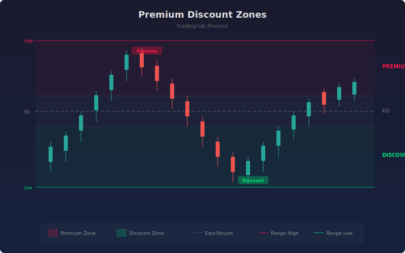

# Premium Discount Zones

Maps price relative to its range midpoint, identifying premium zones where price is expensive relative to the range and discount zones where price is cheap. This framework helps traders align entries with favorable pricing within the current market range.

## How It Works

- Calculates the highest high and lowest low over a configurable range period.
- Computes the midpoint (equilibrium) of the range.
- Classifies price position as premium (above equilibrium + band), discount (below equilibrium - band), or equilibrium.
- Plots range boundaries, equilibrium line, and equilibrium band edges.
- Shades the background to visually distinguish premium, discount, and equilibrium zones.

## Parameters

| Parameter | Default | Range | Description |
|-----------|---------|-------|-------------|
| Range Length | 50 | 10-200 | Lookback for calculating the price range |
| Equilibrium Band % | 0.1 | 0.01-0.3 | Width of the equilibrium zone as a fraction of range |
| Show Equilibrium | true | on/off | Display equilibrium band boundaries |
| Show Zone Labels | true | on/off | Display labels when entering premium or discount zones |

## Outputs

- **Range High**: Step-line at the rolling range high (red)
- **Range Low**: Step-line at the rolling range low (green)
- **Equilibrium**: Dashed midpoint line
- **Background**: Red tint in premium, green tint in discount, subtle white in equilibrium

## Usage Notes

- Look for long entries in the discount zone and short entries in the premium zone.
- The equilibrium zone represents fair value where neither buyers nor sellers have a clear edge.
- Combine with displacement or structure shift signals for higher-probability setups.
