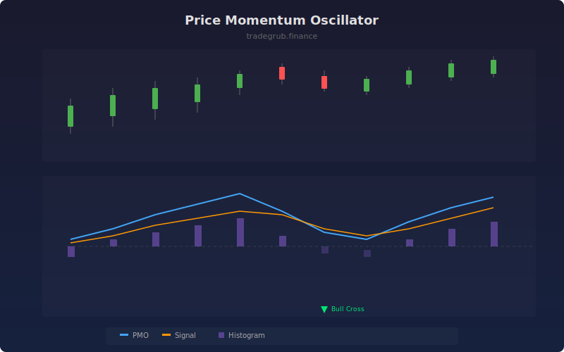

# Price Momentum Oscillator

The Price Momentum Oscillator (PMO) applies double exponential smoothing to a rate of change calculation, producing a clean momentum indicator. Signal line crossovers provide actionable buy and sell signals while the histogram visualizes momentum shifts.

## How It Works

- Calculates a 1-bar rate of change as a percentage
- Applies a first EMA smoothing (default 35 periods) to remove noise
- Applies a second EMA smoothing (default 20 periods) for the final PMO line
- Generates a signal line using a 10-period EMA of the PMO
- Crossovers between PMO and signal indicate momentum shifts

## Parameters

| Parameter | Default | Range | Description |
|-----------|---------|-------|-------------|
| ROC Period | 1 | 1-10 | Rate of change lookback |
| First Smoothing | 35 | 5-100 | First EMA smoothing period |
| Second Smoothing | 20 | 5-100 | Second EMA smoothing period |
| Signal Length | 10 | 3-30 | Signal line EMA period |

## Outputs

- **PMO**: Main momentum line (blue)
- **Signal**: Signal line for crossovers (orange)
- **Histogram**: Difference between PMO and signal (purple)
- **Markers**: Triangle markers at crossover points

## Usage Notes

- Bullish crossover (PMO crosses above signal) suggests increasing upward momentum
- Divergences between price and PMO can signal upcoming reversals
- The zero line acts as a trend filter, with positive PMO favoring long positions
