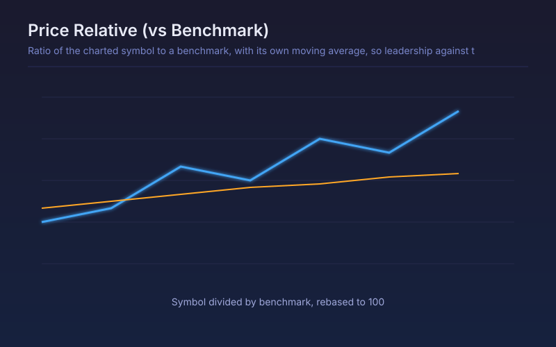

# Price Relative (vs Benchmark)

Ratio of the charted symbol to a benchmark, with its own moving average, so leadership against the market is readable directly.

## Conceptual Diagram

## Parameters

| Parameter | Default | Range | Description |
|-----------|---------|-------|-------------|
| Benchmark symbol | SPY | any symbol | Series the charted symbol is divided by |
| Ratio MA length | 50 | 2-400 | Moving average applied to the ratio |
| Rebase to 100 | True | true/false | Start the ratio at 100 so the whole history is readable as a percentage |

## Signals

- Ratio rising: the symbol is outperforming the benchmark, whatever both are doing in absolute terms
- Ratio above its moving average: current leadership, the standard rotation read
- Turns leader marker: the ratio crossing up through its average
- Turns laggard marker: the ratio crossing back below

## Usage

Use for sector and stock rotation work, where the question is not whether a name is going up but whether it is going up faster than the index. A stock can rally and still be a laggard, and only the ratio shows that.
