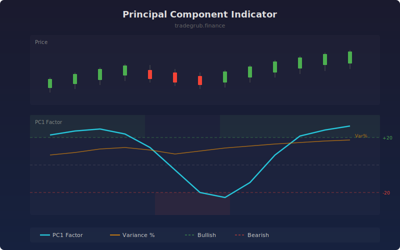

# Principal Component Indicator

Applies principal component analysis to extract the dominant factor from RSI, MACD histogram, price distance from SMA, and stochastic oscillator. The first principal component captures the shared directional signal across all four indicators, reducing noise from any single measure.

## How It Works

- Collects four technical features over a rolling window: RSI, MACD histogram, ATR-normalized price distance, and stochastic K
- Standardizes features and runs PCA to find the first principal component
- The PC1 score represents the dominant shared signal across all features
- Also reports variance explained percentage, indicating how well the single factor captures total information
- Smoothing reduces bar-to-bar noise in the extracted factor

## Parameters

| Parameter | Default | Range | Description |
|-----------|---------|-------|-------------|
| Feature Length | 14 | 5-50 | Period for RSI, ATR, and SMA calculations |
| PCA Window | 60 | 30-150 | Rolling window for PCA computation |
| Smoothing | 5 | 1-15 | SMA smoothing on the PC1 score |

## Outputs

- **PC1 Factor**: Dominant principal component score (cyan line)
- **Variance Explained %**: How much variance PC1 captures (orange line)
- **Reference Lines**: Bullish (+20), bearish (-20), and zero levels
- **Background**: Green shading for bullish, red for bearish factor readings

## Usage Notes

- High variance explained (above 60%) means the indicators are in strong agreement
- PC1 crossing zero with high variance explained produces the most reliable signals
- Low variance explained suggests conflicting indicators, favoring caution
