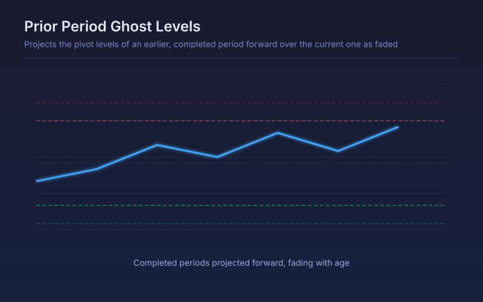

# Prior Period Ghost Levels

Projects the pivot levels of an earlier, completed period forward over the current one as faded reference lines, so old structure stays visible without cluttering the live chart.

## Conceptual Diagram

## Parameters

| Parameter | Default | Range | Description |
|-----------|---------|-------|-------------|
| Period length (bars) | 120 | 10-1000 | Bars per period; 120 is roughly a quarter of daily bars |
| Periods back to ghost | 2 | 1-6 | How many completed periods are projected forward |
| Show each period midpoint | True | true/false | Also draw the midpoint between each period's high and low |

## Signals

- Price approaching a ghosted high or low: old structure that many participants still have marked
- Ghost levels stacking at a similar price: repeated periods that turned in the same area
- Fading with age: the further back the period, the fainter its levels, so the current one reads first
- The nearest ghost high and low are also plotted as series, so they can be alerted on

## Usage

Use when the current period's structure is too young to be informative and the levels that matter belong to a period that has already closed. Set the period length to whatever cycle actually matters for the instrument rather than leaving the default.
