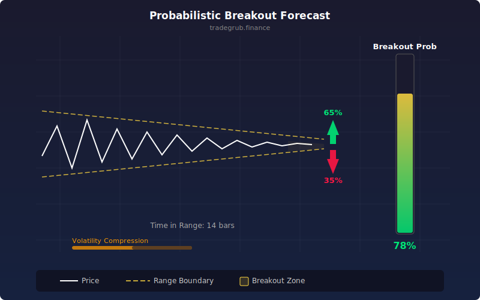

# Probabilistic Breakout Forecast

Calculates the statistical probability of price breaking out of its current range within N bars. Uses historical volatility and range compression to estimate how likely a breakout is.

## Conceptual Diagram

## Parameters

- **Range Length** (default 20): lookback period for defining the current high/low range
- **ATR Length** (default 14): period for the Average True Range volatility baseline
- **Probability Threshold** (default 80): level above which breakout is considered highly likely

## Signals

- **Probability line**: oscillator from 0 to 100 showing estimated breakout likelihood
- **Triangle markers**: appear when probability exceeds the threshold (default 80%)
- **Background highlight**: shading activates when probability rises above 70%

## How It Works

1. The indicator defines the current price range using the highest high and lowest low over the range length.
2. It measures range width as a percentage of price and compares it to ATR-based expected volatility.
3. A compression ratio captures how tight the range is relative to what volatility would predict. Tighter ranges produce higher compression scores.
4. A time factor counts how many consecutive bars price has stayed within the range without making new highs or lows.
5. These two factors combine using an exponential formula: probability = 1 - exp(-compression * time). As consolidation tightens and persists, breakout probability rises toward 100%.
6. The result plots as an oscillator with reference lines at the threshold and at 50%.
