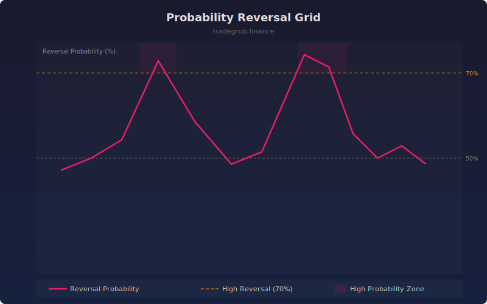

# Probability Reversal Grid

Divides the recent price range into zones and calculates the historical probability of a reversal occurring at each zone. Bars in high-reversal zones are highlighted.

## How It Works

- Normalizes price position within the recent lookback range (0-100)
- Divides the range into configurable zones
- For each zone, examines historical instances and checks if the next move reversed direction
- Current bar gets a reversal probability score based on its zone's historical reversal rate

## Parameters

| Parameter | Default | Range | Description |
|-----------|---------|-------|-------------|
| Lookback | 100 | 20-500 | Rolling window for range and historical analysis |
| Number of Zones | 10 | 5-50 | Granularity of the price range grid |

## Outputs

- **Reversal Probability**: Pink line showing reversal chance (0-100%)
- **High Reversal Zone**: Orange dashed line at 70%
- **Neutral**: Gray dashed line at 50%
- **Background**: Pink shading when probability exceeds 70%

## Usage Notes

- High reversal probability at range extremes confirms potential mean-reversion setups
- Works best in ranging markets; trending markets naturally show lower reversal rates
- Wider zones (fewer bins) produce smoother but less precise probability estimates
