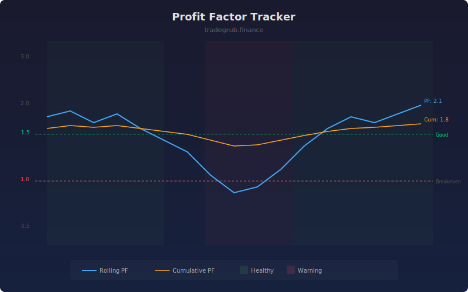

# Profit Factor Tracker

Tracks rolling and cumulative profit factor as a real-time strategy health metric. Profit factor is the ratio of gross profits to gross losses, where values above 1.0 indicate a profitable edge and higher values indicate stronger performance.

## How It Works

- Calculates bar-over-bar price changes as proxy trade results
- Sums positive changes (gross profit) and negative changes (gross loss) over a rolling window
- Computes profit factor as gross profit divided by gross loss
- Tracks both rolling and cumulative profit factor for short-term and long-term views
- Highlights periods above "good" level in green and below "warning" level in red

## Parameters

| Parameter | Default | Range | Description |
|-----------|---------|-------|-------------|
| Lookback Period | 50 | 10-200 | Rolling window for profit factor calculation |
| Warning Level | 1.0 | 0.5-2.0 | Profit factor below this triggers warning |
| Good Level | 1.5 | 1.0-3.0 | Profit factor above this indicates healthy edge |

## Outputs

- **Rolling PF**: Blue line showing rolling profit factor
- **Cumulative PF**: Orange line showing all-time profit factor
- **Warning Line**: Red dashed line at warning threshold
- **Good Line**: Green dashed line at good threshold
- **Breakeven Line**: Gray dashed line at 1.0

## Usage Notes

- Profit factor below 1.0 means losses exceed profits and the strategy is losing money
- Values between 1.5 and 2.0 are generally considered strong for most strategies
- A declining rolling PF while cumulative PF holds steady may signal changing market conditions
