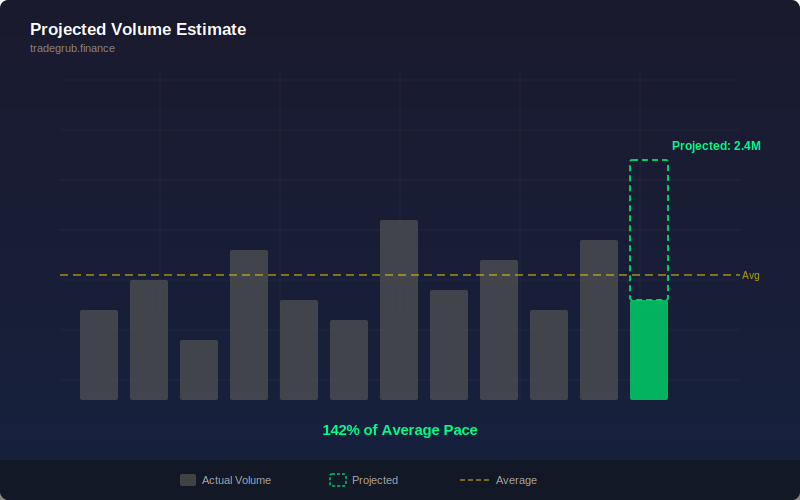

# Projected Volume Estimate

Estimates the projected final volume for the current bar based on historical volume accumulation patterns, displayed as a ratio against average volume.

## Conceptual Diagram

## Parameters

- **Lookback** (default 20): Number of historical bars used to compute average volume and accumulation profile

## How It Works

The indicator computes a volume completion rate based on position within the rolling window and uses it to project what the final volume will be. The projected volume is divided by the average volume to produce a ratio.

A ratio of 1.0 means projected volume matches the historical average. Values above 2.0 indicate unusually high volume activity, while values below 0.5 suggest low participation.

## Signals

- **Ratio above 2.0**: Exceptionally high projected volume (blue background highlight)
- **Ratio near 1.0**: Normal volume activity
- **Ratio below 0.5**: Below-average volume, low participation (orange background)

## Usage

Use to gauge whether the current bar is developing unusual volume characteristics early. High projected volume during breakouts confirms conviction. Low projected volume during moves suggests potential false breakout. Best used alongside price action and trend indicators.
