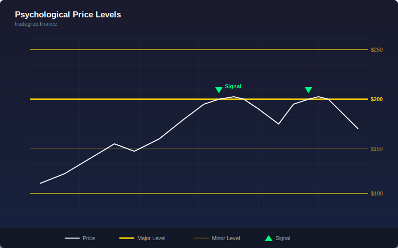

# Psychological Price Levels

Automatically draws horizontal lines at round number price levels based on the current price magnitude.

## Conceptual Diagram

## How It Works

The indicator detects the price scale and draws lines at psychologically significant round numbers:

- Price below 10: levels at 0.50 intervals
- Price 10 to 100: levels at 5.00 intervals
- Price 100 to 1000: levels at 25.00 intervals
- Price above 1000: levels at 100.00 intervals

Lines are drawn within a 20% band above and below the current price.

## Parameters

None. The indicator automatically adapts to the price scale.

## Signals

- Round number levels often act as support and resistance
- Price tends to stall, reverse, or accelerate through these levels
- Clusters of volume near round numbers confirm their significance

## Usage

Add to any chart as an overlay. The indicator draws up to 15 horizontal lines at the nearest round number price levels. Use these levels to identify potential support/resistance zones, set targets, or place stops.
