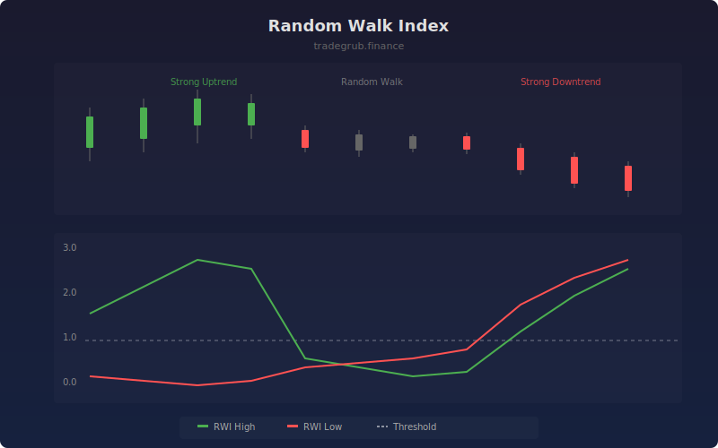

# Random Walk Index

The Random Walk Index (RWI) determines whether price movement represents a meaningful trend or random noise. It compares actual price range over multiple periods to the range expected from a random walk, using ATR-normalized distance. Values above 1.0 suggest trending behavior.

## How It Works

- Calculates the maximum high-to-low range across multiple lookback intervals
- Normalizes each range by ATR multiplied by the square root of the interval length
- RWI High measures uptrend strength, RWI Low measures downtrend strength
- Values above the threshold indicate statistically significant trends
- Random walk (non-trending) markets keep both lines below 1.0

## Parameters

| Parameter | Default | Range | Description |
|-----------|---------|-------|-------------|
| Period | 14 | 2-100 | Maximum lookback for range comparison |
| Trend Threshold | 1.0 | 0.5-3.0 | Level above which trend is considered significant |

## Outputs

- **RWI High**: Uptrend strength line (green)
- **RWI Low**: Downtrend strength line (red)
- **Threshold**: Horizontal reference for trend significance
- **Background**: Shading when trend threshold is exceeded

## Usage Notes

- When RWI High exceeds the threshold while RWI Low stays below, a strong uptrend is confirmed
- When both lines are below 1.0, the market is range-bound or choppy
- Useful as a filter to avoid trading mean-reversion strategies during trending markets
