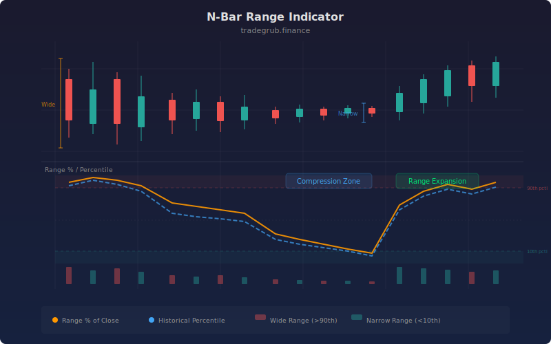

# N-Bar Range Indicator

The N-Bar Range Indicator measures the high-low range over a configurable number of bars as a percentage of the close price, with a historical percentile ranking to contextualize whether the current range is wide or narrow relative to its own history. This dual-output design combines absolute range measurement with statistical context, making it a powerful tool for identifying breakout setups during compression and gauging whether trending moves are overextended.

## Conceptual Diagram



## How It Works

The indicator calculates the difference between the highest high and lowest low over the lookback period (default 14 bars) to establish the absolute range. This range is then divided by the current close price and multiplied by 100 to produce a percentage, normalizing it for cross-instrument comparison just like ATR Percent.

The range percentage is then ranked against its own history using percentile ranking over a configurable lookback (default 100 bars). This percentile tells you where the current range sits relative to recent history: a reading of 90 means the range is wider than 90% of the last 100 bars. A reading of 10 means the range is narrower than 90% of recent history.

A simple moving average of the range percentage (using the same length as the range calculation) provides a baseline for comparison. When the raw range percentage pulls above its average, ranges are expanding. When it drops below, ranges are contracting.

Background highlighting draws attention to extreme readings. Percentile readings above the high threshold (default 80) shade the background red, warning that the range is historically wide and may be overextended. Readings below the low threshold (default 20) shade green, signaling compression that often precedes breakouts.

## Parameters

| Parameter | Default | Range | Description |
|-----------|---------|-------|-------------|
| Length | 14 | 2 - 100 | Number of bars for the high-low range calculation |
| Percentile Lookback | 100 | 20 - 500 | Period for percentile ranking of the range |
| High Range Percentile | 80 | 60 - 95 | Threshold for wide range classification |
| Low Range Percentile | 20 | 5 - 40 | Threshold for narrow range classification |

## Python Advantage

The range computation, percentage normalization, and percentile ranking are all expressed as chained vectorized operations across the full price history:

```python
# Vectorized range computation and normalization
hi = ta.highest(high, length)
lo = ta.lowest(low, length)
rng = hi - lo
rng_pct = (rng / close) * 100

# Historical percentile ranking — full array in one call
rng_percentile = ta.percentrank(rng_pct, pct_len)

# Moving average baseline for trend comparison
avg_range = ta.sma(rng_pct, length)

# Boolean array masking for background highlighting
bgcolor(rng_percentile > high_thresh, color="rgba(239,83,80,0.06)")
bgcolor(rng_percentile < low_thresh, color="rgba(38,166,154,0.06)")
```

The `ta.percentrank` function computes a rolling percentile for every bar across the entire dataset in a single vectorized call. In Pine, `ta.percentrank` exists but cannot be chained with downstream array operations the way Python allows. You could extend this with `np.where(rng_percentile < 10, "extreme_squeeze", "normal")` for multi-level classification, or compute `np.diff(rng_percentile)` to detect the rate of change of the percentile for acceleration signals.

## When to Use

The Range Indicator works on all timeframes and asset classes. It is most effective on daily charts for identifying breakout setups during low-percentile compression periods. Use it on intraday charts to detect session range expansion or contraction. It is particularly valuable for volatility breakout strategies where entries are timed to periods of narrow range that precede directional moves.

## Risk Management

During narrow-range periods (low percentile), set breakout entries just beyond the range boundaries with tight stops. The narrow range itself defines the risk: the distance from entry to the opposite side of the range. During wide-range periods (high percentile), be cautious of entering in the direction of the move, as extended ranges often revert. Use the percentile reading to scale position size inversely: smaller positions during wide ranges, larger during narrow ranges where risk is defined.

## Combining with Other Indicators

- **ATR Percent**: Use ATR Percent alongside the Range Indicator for a two-dimensional volatility view: ATR% measures average bar-by-bar volatility while the Range Indicator measures the full N-bar envelope.
- **Volatility Regime**: Cross-reference range percentile with the Volatility Regime score for multi-factor volatility classification.
- **MA Crossover Signal**: Time crossover entries during narrow-range periods when the Range Indicator shows percentile readings below 20, as breakouts from compression tend to produce the strongest follow-through.
