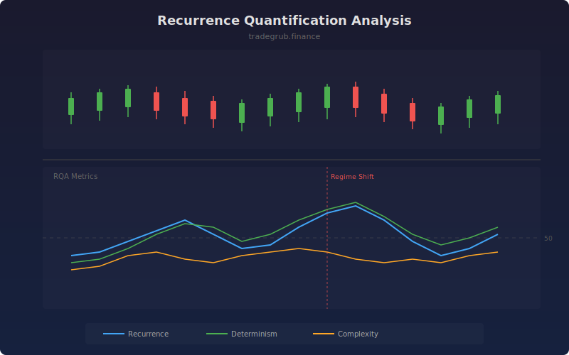

# Recurrence Quantification Analysis

Analyzes recurrence patterns in price data to measure market complexity and detect regime changes. By embedding price into a higher-dimensional phase space, RQA reveals hidden structural patterns that traditional indicators miss, including deterministic behavior and transitions between ordered and chaotic market states.

## How It Works

- Embeds price data into phase space using time-delay coordinates
- Constructs a recurrence matrix identifying when states revisit previous neighborhoods
- Recurrence Rate measures how often price revisits similar states (mean reversion tendency)
- Determinism quantifies how much of the recurrence follows diagonal patterns (predictable structure)
- Complexity entropy measures the diversity of recurring pattern lengths

## Parameters

| Parameter | Default | Range | Description |
|-----------|---------|-------|-------------|
| Embedding Dimension | 3 | 2-5 | Phase space dimensionality |
| Time Delay | 1 | 1-10 | Delay between embedding coordinates |
| Threshold (%) | 10.0 | 1-50 | Neighborhood radius as percentage of range |
| Rolling Window | 50 | 20-100 | Window size for rolling RQA computation |

## Outputs

- **Recurrence Rate**: How often states recur (0-100%, blue)
- **Determinism**: Predictability of recurring patterns (0-100%, green)
- **Complexity**: Entropy of diagonal line lengths (orange)

## Usage Notes

- High determinism with rising recurrence rate suggests a trending, predictable market
- Sudden drops in determinism often precede regime changes or breakouts
- High complexity readings indicate a mixed market with multiple competing dynamics
