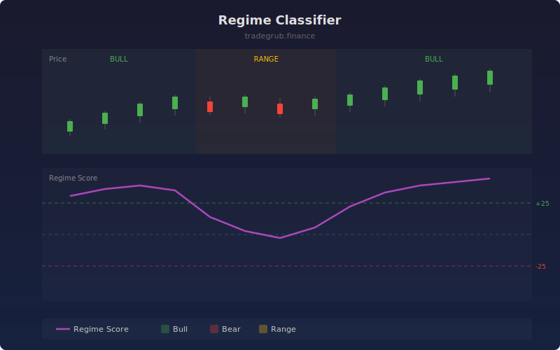

# Regime Classifier

Classifies the current market into bull, bear, or range regimes using a gradient boosted multi-class classifier. Features include trend strength, volatility, and RSI, producing a regime score that helps traders align strategy selection with market conditions.

## How It Works

- Extracts features: SMA crossover trend strength (normalized by ATR), percentage volatility, and normalized RSI
- Labels historical bars as bull, bear, or range based on forward returns relative to volatility
- Trains a multi-class gradient boosted classifier on a rolling window
- Outputs a regime score: bull probability minus bear probability, scaled to -100 to +100
- Falls back to a heuristic scoring model when the boosting library is unavailable

## Parameters

| Parameter | Default | Range | Description |
|-----------|---------|-------|-------------|
| Feature Length | 14 | 5-50 | Period for RSI, ATR, and SMA calculations |
| Training Window | 80 | 40-150 | Rolling window for classifier training |
| Smoothing | 3 | 1-10 | SMA smoothing applied to raw regime score |

## Outputs

- **Regime Score**: Smoothed bull-bear probability differential (purple line, -100 to +100)
- **Bull Zone**: Dashed green line at +25
- **Bear Zone**: Dashed red line at -25
- **Background**: Green (bull), red (bear), yellow (range) shading

## Usage Notes

- Use regime classification to select appropriate strategies: trend-following in bull/bear, mean-reversion in range
- Regime transitions (score crossing zero) often mark significant turning points
- The range regime (yellow background) suggests avoiding directional strategies
