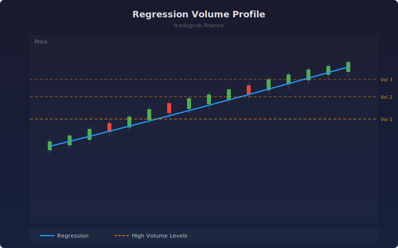

# Regression Volume Profile

Maps volume distribution along a polynomial regression curve rather than fixed horizontal price levels. Identifies where the most trading activity occurred relative to the trend.

## How It Works

- Fits a polynomial regression (configurable degree) to recent close prices
- Computes residuals (price distance from regression line)
- Bins residuals and sums volume in each bin
- Plots the top 3 highest-volume levels as horizontal lines offset from the regression endpoint

## Parameters

| Parameter | Default | Range | Description |
|-----------|---------|-------|-------------|
| Lookback | 100 | 20-500 | Number of bars for regression and volume analysis |
| Polynomial Degree | 2 | 1-5 | Degree of the polynomial regression fit |
| Number of Bins | 20 | 5-50 | Granularity of volume distribution buckets |

## Outputs

- **Regression Line**: Blue polynomial fit on the price chart
- **Volume Levels 1-3**: Orange dashed lines at the highest-volume price zones

## Usage Notes

- High-volume levels near the regression line act as dynamic support and resistance
- Use degree 2 for most markets; higher degrees may overfit on short lookbacks
- Combine with momentum indicators to confirm breakouts from volume levels
