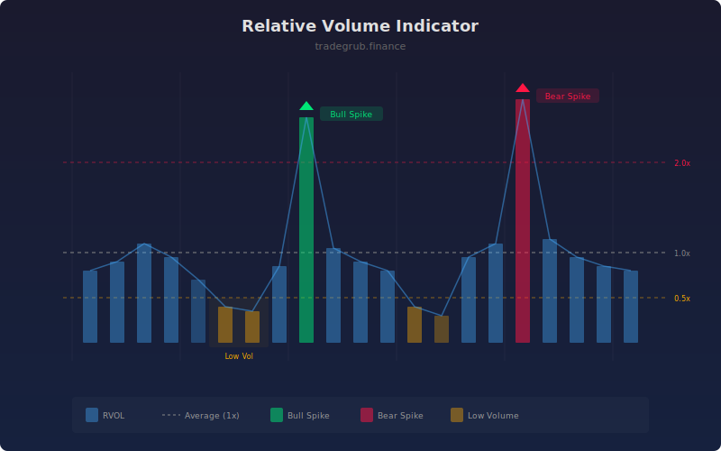

# Relative Volume Indicator

Compares current volume to its historical average to detect unusual activity spikes and changes in market participation. Relative volume (RVOL) normalizes volume readings so they can be compared across different instruments and timeframes on a consistent scale.

## How It Works

- Computes a simple moving average of volume over a configurable lookback period.
- Divides current volume by the average to produce the RVOL ratio.
- Flags volume spikes when RVOL exceeds the spike threshold multiplier.
- Flags low-volume bars when RVOL falls below the low threshold.
- Classifies spikes by price direction (bullish or bearish candle) for context.

## Parameters

| Parameter | Default | Range | Description |
|-----------|---------|-------|-------------|
| Average Length | 20 | 5-100 | Lookback for the volume moving average |
| Spike Threshold | 2.0 | 1.0-5.0 | RVOL above this level flags a spike |
| Low Volume Threshold | 0.5 | 0.1-1.0 | RVOL below this level flags low activity |
| Smoothing | 1 | 1-10 | Smoothing applied to the RVOL line |

## Outputs

- **RVOL**: Main relative volume line (blue)
- **Average Line**: Dashed line at 1.0 (average volume)
- **Spike Level**: Dashed line at the spike threshold
- **Volume Spike markers**: Triangles on high-volume bars
- **Bull/Bear Spike**: Diamonds showing price direction on spike bars

## Usage Notes

- RVOL above 2.0 with a breakout suggests strong participation backing the move.
- RVOL below 0.5 during a move warns that the trend lacks conviction.
- Use spike direction (bull vs bear) to assess whether the unusual volume supports or opposes the current trend.
