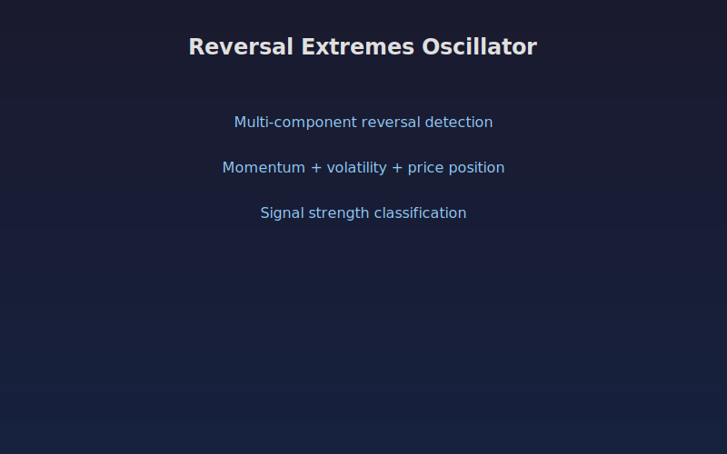

# Reversal Extremes Oscillator

Multi-component oscillator combining momentum, volatility, and price behavior analysis to identify potential market reversals and extreme conditions with signal strength classification. This reversal detection indicator provides quantitative signals that can be applied to any liquid market across all timeframes.

## Conceptual Diagram



## How It Works

The indicator analyzes price data using reversal detection techniques to produce actionable signals.

Built-in technical functions used: `atr, rsi, sma, stoch`. These provide the foundation for the indicator's calculations, computed efficiently across the full price history in a single pass.

Core techniques include simple moving average, RSI, ATR, Stochastic. The computation processes all bars simultaneously using vectorized numpy operations, ensuring consistent results regardless of the dataset size.

Integer parameters control window lengths and thresholds, allowing the indicator to adapt from scalping on short timeframes to position trading on weekly charts. Shorter windows increase sensitivity to recent price action while longer windows provide smoother, more reliable signals.

## Parameters

| Parameter | Default | Range | Description |
|-----------|---------|-------|-------------|
| Momentum Length | 14 | 5 - 50 | Controls momentum length sensitivity (int) |
| Volatility Length | 20 | 10 - 60 | Controls volatility length sensitivity (int) |
| Historical Lookback | 100 | 50 - 252 | Controls historical lookback sensitivity (int) |
| Signal Length | 5 | 2 - 15 | Controls signal length sensitivity (int) |

## Signals

- **Reversal Score**: Primary visual output plotted as a continuous line on the chart
- **Signal**: Primary visual output plotted as a continuous line on the chart
- **Strength**: Primary visual output plotted as a continuous line on the chart
- **Bearish Extreme** (0.5): Reference level for threshold-based decisions
- **Bullish Extreme** (-0.5): Reference level for threshold-based decisions
- **Zero** (0): Reference level for threshold-based decisions
- **Background shading**: Highlights active signal zones based on extreme_bull.tolist()
- **Background shading**: Highlights active signal zones based on extreme_bear.tolist()

## Python Advantage

The entire computation runs as vectorized numpy operations, processing all bars simultaneously rather than one at a time:

```python
stoch_k, stoch_d = ta.stoch(high, low, close, mom_len, 3, 3)
sk = np.array(stoch_k, dtype=float)
sk = np.nan_to_num(sk, nan=50.0)

atr_arr = np.array(ta.atr(high, low, close, vol_len), dtype=float)
atr_arr = np.nan_to_num(atr_arr, nan=1.0)

mom_score = (rsi_arr - 50) / 50 * 0.5 + (sk - 50) / 50 * 0.5

vol_pct = np.zeros(n)
for i in range(lookback, n):
```

Python's numpy arrays allow element-wise arithmetic across thousands of bars in a single expression. Adding custom variations or combining with other calculations is straightforward, requiring only standard array operations.

## When to Use

- Identify potential trend reversals early
- Confirm reversal signals with multiple indicators
- Set entries near reversal zones with defined risk
- Distinguish between pullbacks and genuine reversals

Works best on daily and intraday charts for liquid instruments. Shorter parameter values suit scalping and day trading while longer values work for swing and position trading.

## Risk Management

No indicator is predictive on its own. Always define risk before entering a trade:

- Set stop-losses based on ATR or recent swing points, not arbitrary percentages
- Size positions so that a stop-loss hit risks no more than 1-2% of account equity
- Avoid adding to losing positions based solely on indicator readings
- Backtest parameter combinations on out-of-sample data before live trading

## Combining with Other Indicators

- **Moving Average Ribbon**: Use the Moving Average Ribbon to confirm the overall trend direction before acting on this indicator's signals. Trading in the direction of the ribbon produces higher win rates.
- **Volume Profile POC**: When this indicator's signal aligns with a high-volume node from the Volume Profile, the confluence creates a stronger setup with better follow-through.
- **RSI or Stochastic**: Add a momentum oscillator as a confirmation filter. Signals that align with oversold or overbought momentum readings tend to produce larger moves.
