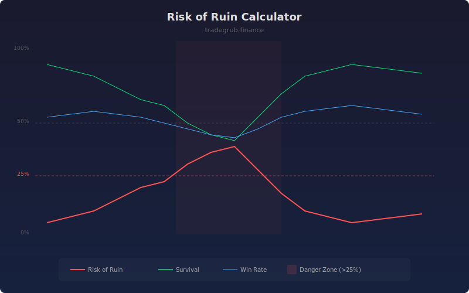

# Risk of Ruin Calculator

Estimates the probability of account ruin by running Monte Carlo simulations using rolling historical return distributions. This indicator quantifies the likelihood of drawdown beyond a specified ruin threshold given current market conditions and position sizing.

## How It Works

- Collects bar-over-bar returns over a rolling lookback window
- Runs Monte Carlo simulations by randomly resampling historical returns
- Tracks how many simulated equity paths breach the ruin level threshold
- Reports the percentage of paths that result in ruin as the Risk of Ruin
- Survival rate is simply 100% minus the risk of ruin

## Parameters

| Parameter | Default | Range | Description |
|-----------|---------|-------|-------------|
| Lookback Period | 50 | 10-200 | Number of bars for return distribution |
| Risk Per Trade % | 2.0 | 0.1-10.0 | Position size as percentage of capital |
| Ruin Level % | 50.0 | 10-90 | Account drawdown that defines ruin |
| Simulations | 100 | 20-500 | Number of Monte Carlo paths to simulate |

## Outputs

- **Risk of Ruin %**: Red line showing probability of account ruin
- **Survival %**: Green line showing probability of survival
- **Win Rate %**: Blue line showing rolling win rate
- **Danger Zone**: Red background when risk of ruin exceeds 25%

## Usage Notes

- Risk of ruin above 25% suggests reducing position size or pausing trading
- Increasing position size dramatically increases risk of ruin in a non-linear way
- Compare different risk per trade settings to find a sustainable sizing approach
