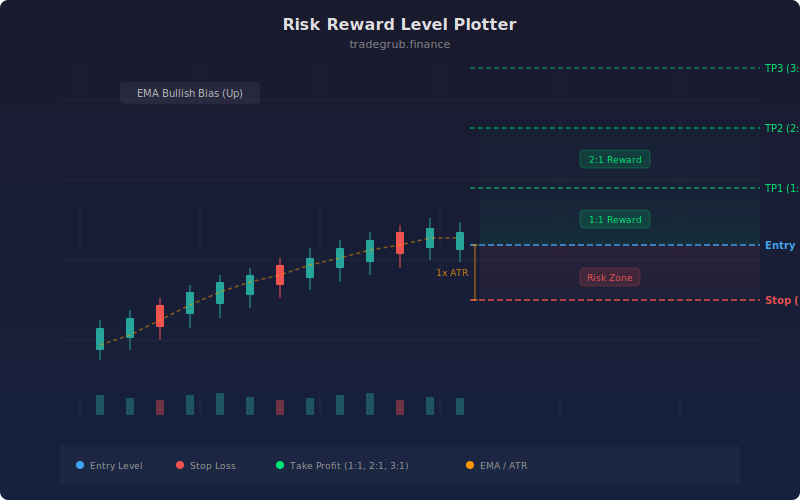

# Risk Reward Level Plotter

This indicator calculates and plots entry, stop-loss, and multiple take-profit levels based on ATR-derived risk distances. It uses an EMA directional bias to determine whether to plot bullish or bearish level structures, giving traders a clear visual framework for planning trades with defined risk-reward ratios.

## Conceptual Diagram



## How It Works

The indicator computes the Average True Range over a configurable lookback period and multiplies it by a user-defined factor to establish the base risk distance (1R). This risk distance sets the stop-loss placement relative to the current price.

Take-profit levels are then projected at multiples of this risk distance. For example, with a 1.5R target, the first take-profit sits at 1.5 times the risk distance from entry. The indicator plots three independent take-profit levels, each with its own configurable ratio.

Directional bias comes from an EMA filter. When price is above the EMA, the indicator plots bullish levels (stop below, targets above). When price is below the EMA, it flips to bearish levels (stop above, targets below). Triangle markers appear at EMA crossover points to highlight potential bias shifts.

## Parameters

| Name | Default | Range | Description |
|------|---------|-------|-------------|
| ATR Length | 14 | 5 - 50 | Lookback period for ATR calculation |
| ATR Multiplier | 1.5 | 0.5 - 5.0 | Multiplier applied to ATR for the base risk distance |
| R:R Target 1 | 1.5 | 0.5 - 10.0 | Risk-reward ratio for the first take-profit level |
| R:R Target 2 | 2.5 | 0.5 - 10.0 | Risk-reward ratio for the second take-profit level |
| R:R Target 3 | 3.5 | 0.5 - 10.0 | Risk-reward ratio for the third take-profit level |
| Use EMA Bias | True | on/off | Toggle EMA-based directional filtering |
| EMA Length | 50 | 10 - 200 | Period for the EMA directional bias filter |

## Python Advantage

Vectorized computation makes level calculation across the full dataset fast and concise:

```python
risk_dist = atr * atr_mult
tp1_long = entry + risk_dist * rr1
tp2_long = entry + risk_dist * rr2
stop = numpy.where(bullish, stop_long, stop_short)
tp1 = numpy.where(bullish, tp1_long, tp1_short)
```

All levels are computed in parallel across every bar without explicit loops.

## When to Use

Use this indicator during trade planning to visualize where your stop and targets sit relative to current volatility. It is especially useful for traders who size positions based on fixed risk-reward frameworks. Apply it after identifying a setup from your primary analysis, then reference the plotted levels to decide whether the reward justifies the risk at the current price.

## Risk Management

The ATR-based stop placement automatically adjusts to current market volatility. In high-volatility environments, stops widen to avoid noise-driven exits. In low-volatility conditions, stops tighten to preserve capital. Always verify that the plotted stop distance is acceptable for your position size and account risk tolerance before entering a trade.

## Combining with Other Indicators

- **RSI or Stochastics:** confirm that entries align with oversold (long) or overbought (short) readings before using the plotted levels
- **Volume Profile:** check that take-profit levels do not sit directly inside high-volume nodes where price tends to consolidate
- **Support and Resistance:** validate that the stop-loss level is placed beyond a meaningful structural level, not in open space where it offers no logical protection
