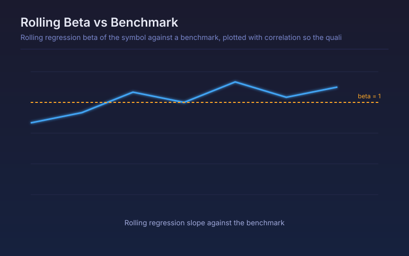

# Rolling Beta vs Benchmark

Rolling regression beta of the symbol against a benchmark, plotted with correlation so the quality of the fit is visible alongside it.

## Conceptual Diagram

## Parameters

| Parameter | Default | Range | Description |
|-----------|---------|-------|-------------|
| Benchmark symbol | SPY | any symbol | Market series the regression is run against |
| Regression window | 60 | 10-500 | Bars in each rolling regression |

## Signals

- Beta above 1: the symbol amplifies market moves, so position size should shrink accordingly
- Beta below 1: the symbol dampens market moves
- Beta near zero or negative: the name is currently trading independently of, or against, the market
- Low correlation alongside any beta reading: the regression fit is weak and the beta is not trustworthy

## Usage

Use for position sizing and for checking whether a portfolio's names have quietly converged on the same market exposure. Read beta and correlation together, since beta from a low-correlation window is close to noise.
