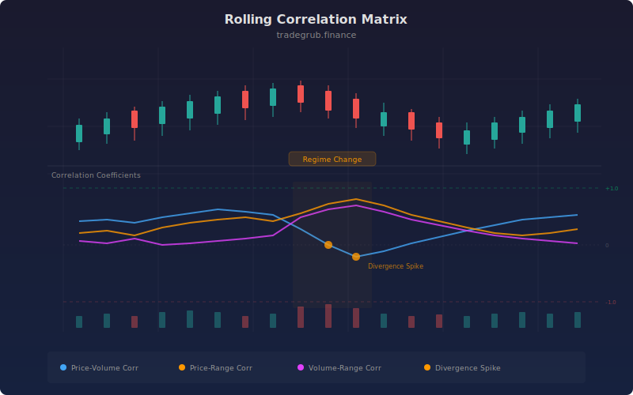

# Rolling Correlation Matrix

Monitors how price returns, volume, and range relate to each other over a rolling window. When these relationships break down or spike, it often signals a regime change: the beginning or end of a trend, a volatility expansion, or a liquidity shift. The indicator uses pandas for efficient rolling correlation and scipy for statistical divergence detection.

## Conceptual Diagram



## How It Works

The indicator computes three pairwise rolling correlations: price returns vs log volume, price returns vs range percentage, and log volume vs range percentage. Each correlation is calculated over a configurable window using pandas `rolling().corr()`, which handles NaN values and provides numerically stable Pearson correlation estimates.

The three correlations are averaged into a composite score and smoothed. Under normal market conditions, these correlations stay within a stable range. When the composite z-score (calculated by scipy) exceeds the threshold, the relationships have shifted significantly, flagging a potential regime change.

High positive correlation spikes often occur during trend acceleration, when price moves are accompanied by expanding volume and range. Deep negative readings suggest distribution or divergence, where volume and range are rising but price is not following through.

## Parameters

| Parameter | Default | Range | Description |
|-----------|---------|-------|-------------|
| Correlation Window | 30 | 10-100 | Bars used for rolling Pearson correlation |
| Divergence Z-Score | 2.0 | 1.0-3.0 | Z-score threshold for flagging unusual correlation readings |
| Smoothing | 5 | 1-20 | SMA smoothing applied to the average correlation |
| Show Divergence Alerts | true | - | Plot diamond markers when z-score exceeds threshold |

## Python Advantage

Pandas and scipy make multi-factor correlation analysis trivial:

```python
import pandas as pd
from scipy.stats import zscore

df = pd.DataFrame({'close': close, 'volume': volume})
df['returns'] = df['close'].pct_change()
df['log_vol'] = np.log1p(df['volume'])

# Rolling correlation in one line
price_vol_corr = df['returns'].rolling(30).corr(df['log_vol'])

# Statistical divergence detection
z_vals = scipy_zscore(avg_smooth.dropna().values)
```

Computing rolling Pearson correlation with proper NaN handling would require implementing the running covariance and standard deviation formulas manually without pandas.

## When to Use

Apply this indicator as an early warning system on any timeframe. It works particularly well on 4-hour to daily charts where regime transitions develop over several bars. Watch for the average correlation dropping below zero after an extended trending period, as this often precedes the beginning of a range or reversal.

## Risk Management

Correlation regime shifts do not indicate direction, only that market dynamics are changing. Use this indicator as a filter: tighten stops or reduce position size when the z-score exceeds the threshold, and widen stops during stable correlation periods. Do not use divergence alerts as standalone entry signals.

## Combining with Other Indicators

- **Market Regime Detector**: Correlation breakdown often precedes regime change detection by several bars
- **Savitzky-Golay Peak Reversal**: Peak detection signals during a correlation divergence carry higher conviction
- **Volatility Regime Indicator**: Cross-reference volatility regime shifts with correlation breakdowns for confluence
