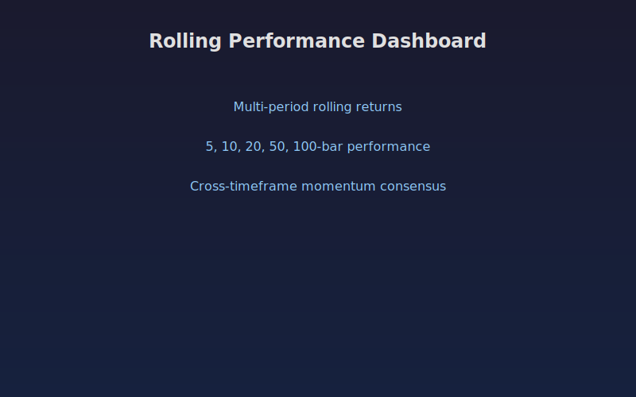

# Rolling Performance Dashboard

Multi-period rolling performance tracker showing returns across 5, 10, 20, 50, and 100-bar windows using numpy. This statistical analysis indicator provides quantitative signals that can be applied to any liquid market across all timeframes.

## Conceptual Diagram



## How It Works

The indicator analyzes price data using statistical analysis techniques to produce actionable signals.

Core techniques include iterative computation. The computation processes all bars simultaneously using vectorized numpy operations, ensuring consistent results regardless of the dataset size.

## Signals

- **Zero** (0): Reference level for threshold-based decisions
- **Background shading**: Highlights active signal zones based on all_positive.tolist()
- **Background shading**: Highlights active signal zones based on all_negative.tolist()

## Python Advantage

The entire computation runs as vectorized numpy operations, processing all bars simultaneously rather than one at a time:

```python
indicator("Rolling Performance Dashboard", overlay=False)

cl = np.array(close, dtype=float)
n = len(cl)

periods = [5, 10, 20, 50, 100]
colors = ["#29b6f6", "#42a5f5", "#66bb6a", "#ff9800", "#ef5350"]

returns = {}
for p in periods:
```

Python's numpy arrays allow element-wise arithmetic across thousands of bars in a single expression. Adding custom variations or combining with other calculations is straightforward, requiring only standard array operations.

## When to Use

- Quantify price behavior with statistical measures
- Identify when price deviates significantly from statistical norms
- Build probabilistic models for price movement expectations
- Detect regime changes through statistical anomalies

Works best on daily and intraday charts for liquid instruments. Shorter parameter values suit scalping and day trading while longer values work for swing and position trading.

## Risk Management

No indicator is predictive on its own. Always define risk before entering a trade:

- Set stop-losses based on ATR or recent swing points, not arbitrary percentages
- Size positions so that a stop-loss hit risks no more than 1-2% of account equity
- Avoid adding to losing positions based solely on indicator readings
- Backtest parameter combinations on out-of-sample data before live trading

## Combining with Other Indicators

- **Moving Average Ribbon**: Use the Moving Average Ribbon to confirm the overall trend direction before acting on this indicator's signals. Trading in the direction of the ribbon produces higher win rates.
- **Volume Profile POC**: When this indicator's signal aligns with a high-volume node from the Volume Profile, the confluence creates a stronger setup with better follow-through.
- **RSI or Stochastic**: Add a momentum oscillator as a confirmation filter. Signals that align with oversold or overbought momentum readings tend to produce larger moves.
