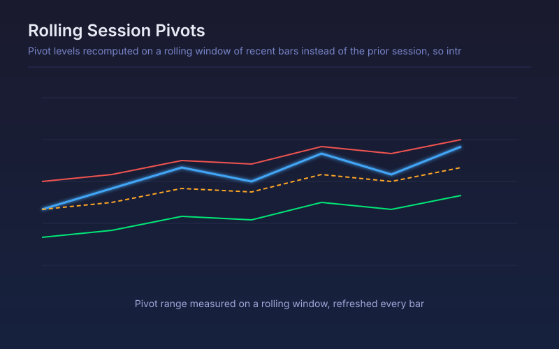

# Rolling Session Pivots

Pivot levels recomputed on a rolling window of recent bars instead of the prior session, so intraday traders get levels that move with the day.

## Conceptual Diagram

## Parameters

| Parameter | Default | Range | Description |
|-----------|---------|-------|-------------|
| Rolling window (bars) | 24 | 4-500 | How many prior bars the pivot range is measured over |
| Pivot formula | Classic | Classic/Fibonacci/Camarilla | Which pivot arithmetic is applied to the rolling range |
| Show the third support and resistance | False | true/false | Plot R3 and S3 as well as the inner levels |

## Signals

- Price above the rolling pivot: the recent window is trading bullishly, whatever the daily pivot says
- R1 and S1 as the first reaction levels, refreshed every bar rather than once a session
- Levels compressing: the rolling range is narrowing, which usually precedes expansion
- Levels that jump between bars: an outlier has entered or left the window, so treat them with less weight

## Usage

Use on intraday charts where waiting for the next session's pivots is too slow, particularly in markets that trade around the clock and have no natural daily open. On daily bars the rolling window and the session are close enough that standard pivots are the better tool.
