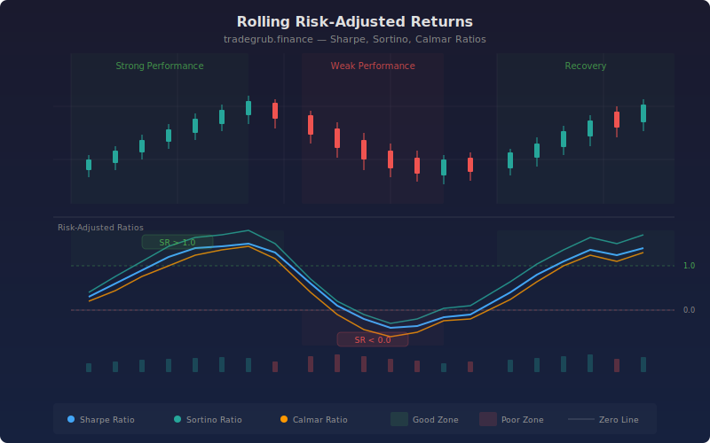

# Rolling Risk-Adjusted Returns

A performance analytics indicator that computes three rolling risk-adjusted return ratios: Sharpe, Sortino, and Calmar. Using numpy for efficient rolling window calculations, the indicator shows how well an instrument has rewarded investors relative to the risk taken, with color-coded zones highlighting periods of strong and weak risk-adjusted performance.

## Conceptual Diagram



## How It Works

The indicator computes daily returns and subtracts the risk-free rate to get excess returns. Over each rolling window, it calculates three ratios that measure return per unit of risk.

The Sharpe ratio divides mean excess return by total standard deviation, then annualizes the result. It penalizes both upside and downside volatility equally, making it the most commonly cited risk-adjusted metric.

The Sortino ratio improves on Sharpe by using only downside deviation (the standard deviation of negative excess returns). This avoids penalizing upside volatility, which investors generally welcome. The Sortino ratio is typically higher than Sharpe for instruments with positive skew.

The Calmar ratio divides annualized return by maximum drawdown within the window. This focuses specifically on worst-case loss, making it relevant for drawdown-sensitive strategies. A high Calmar means the instrument delivered strong returns relative to its worst peak-to-trough decline.

## Parameters

| Parameter | Default | Range | Description |
|-----------|---------|-------|-------------|
| Rolling Window | 60 | 20-252 | Number of bars for rolling calculations |
| Annualization Factor | 252 | 12-365 | Trading days per year for ratio scaling |
| Risk-Free Rate (Annual) | 0.04 | 0.0-0.15 | Annual risk-free rate for excess return |
| Good Performance Threshold | 1.0 | 0.0-3.0 | Sharpe level considered strong performance |
| Poor Performance Threshold | 0.0 | -2.0-1.0 | Sharpe level considered weak performance |
| Show Labels | True | on/off | Toggle performance transition labels |
| Show Levels | True | on/off | Toggle horizontal threshold lines |
| Label Cooldown Bars | 25 | 5-50 | Minimum bars between transition labels |

## Outputs

- **Sharpe Ratio:** Annualized return-to-risk ratio using total volatility (blue line)
- **Sortino Ratio:** Annualized return-to-downside-risk ratio (green line)
- **Calmar Ratio:** Annualized return-to-max-drawdown ratio (orange line)
- **Performance zones:** Green background for strong risk-adjusted returns, red for weak
- **Transition labels:** Annotations where performance shifts between strong and weak

## Python Advantage

Rolling window calculations with numpy enable efficient computation of multiple risk metrics simultaneously:

```python
window = excess_returns[i - lookback + 1:i + 1]
sharpe[i] = (np.mean(window) / np.std(window)) * np.sqrt(252)

downside = window[window < 0]
sortino[i] = (np.mean(window) / np.sqrt(np.mean(downside**2))) * np.sqrt(252)

running_max = np.maximum.accumulate(price_window)
max_dd = abs(np.min(price_window / running_max - 1.0))
calmar[i] = annualized_return / max_dd
```

## Usage Notes

- A Sharpe ratio above 1.0 is generally considered good, above 2.0 is excellent. Negative Sharpe means the instrument underperformed the risk-free rate.
- The Sortino ratio is more useful than Sharpe for instruments with asymmetric return distributions. If Sortino is much higher than Sharpe, the instrument has favorable skew.
- Calmar ratio focuses on drawdown risk. Instruments with high Calmar are recovering from drawdowns quickly relative to their returns.
- Adjust the risk-free rate to match current government bond yields. The default of 4% reflects a moderate rate environment.
- For weekly charts, set the annualization factor to 52. For monthly, use 12. The default of 252 is for daily bars.
- These ratios measure past risk-adjusted performance. They do not guarantee future returns or risk levels.
