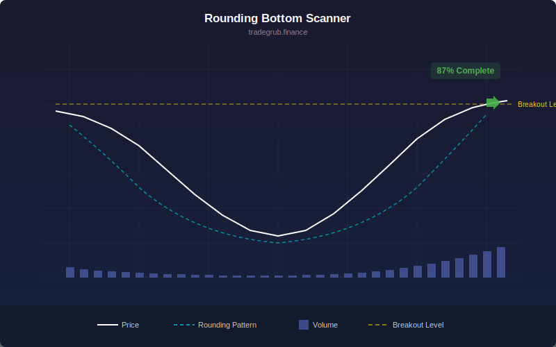

# Rounding Bottom Scanner

Detects rounding bottom (saucer) chart patterns using price curvature analysis and volume profile confirmation. The rounding bottom is a gradual reversal pattern where price transitions from a downtrend into an uptrend, forming a curved base.

## Conceptual Diagram

## Parameters

- **Lookback Window** (default 40): Number of bars to analyze for the pattern. Larger values detect wider, more significant formations.
- **Curvature Threshold** (default 60): Minimum confidence score (0-100) to highlight a potential rounding bottom.
- **Volume Confirmation** (default 1/On): When enabled, the score factors in volume profile. Volume should decline on the left side and increase on the right side of the pattern.

## Signals

- **Rounding Score**: Oscillator (0-100) measuring how closely recent price action matches a rounding bottom shape. Plotted as a cyan line.
- **Threshold Line**: Red horizontal line at your chosen threshold.
- **Background Highlight**: Green tint when the score exceeds the threshold.
- **Breakout Marker**: Green triangle below the bar when price breaks above the neckline (the higher of the two rims) while the score is above threshold.

## How It Works

1. Over the lookback window, the indicator splits price into a left half and right half.
2. It fits a quadratic curve to the full window. A positive leading coefficient means the shape is concave up (U-shaped).
3. It checks that the left half slopes downward and the right half slopes upward.
4. It verifies the lowest price is near the center of the window.
5. If volume confirmation is on, it checks that left-side volume is declining and right-side volume is increasing toward the end.
6. These components combine into a weighted confidence score: curvature (40%), slope direction (30%), center alignment (20%), volume profile (10%).
7. A breakout signal fires when price crosses above the neckline with the score above threshold.
