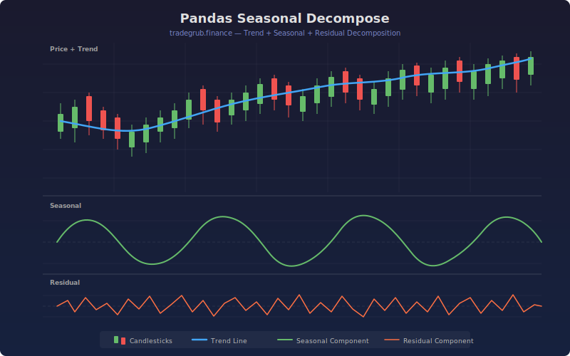

# Seasonal Decomposition

Decomposes price data into three distinct components: trend, seasonal, and residual. Uses pandas-style rolling statistics for trend extraction and numpy FFT for isolating periodic seasonal patterns. All three components are plotted in a single pane for visual analysis of what drives price movement.

## Conceptual Diagram



## How It Works

The decomposition follows three steps. First, the trend component is extracted using a simple moving average over the configurable trend length, capturing the slow-moving directional bias. Second, the detrended series (price minus trend) is transformed into the frequency domain using numpy FFT. The top N frequency components within the seasonal period range are selected and inverse-transformed back to produce a clean seasonal oscillation. Third, the residual is computed by subtracting the seasonal from the detrended series, capturing random noise and event-driven moves.

Each component is normalized to its own display band so all three are visible in one pane: the trend oscillates around 80, the seasonal around 50, and the residual around 20.

## Parameters

| Parameter | Default | Range | Description |
| --------- | ------- | ----- | ----------- |
| Trend Length | 20 | 5-100 | Moving average period for trend extraction |
| Seasonal Period | 10 | 3-50 | Target seasonal cycle length in bars |
| FFT Components | 3 | 1-10 | Number of frequency components for seasonal extraction |
| Residual Smoothing | 5 | 1-20 | Smoothing applied to the residual component |
| Show Labels | true | -- | Toggle seasonal peak/trough annotations |
| Show Levels | true | -- | Toggle decomposition statistics display |

## Outputs

- **Trend (blue):** Slow-moving directional component normalized around 80
- **Seasonal (orange):** Periodic oscillation extracted via FFT, normalized around 50
- **Residual (purple):** Remaining noise after removing trend and seasonal, normalized around 20
- **Background shading:** Green tint when trend is rising, red when falling
- **Labels:** Seasonal peaks and troughs annotated on the chart
- **Statistics:** Dominant seasonal period, residual standard deviation, trend volatility

## Python Advantage

Numpy FFT enables clean decomposition that is not possible in Pine:

```python
import numpy as np

spectrum = np.fft.rfft(detrended)
seasonal_spectrum = np.zeros(len(spectrum), dtype=complex)
seasonal_spectrum[top_indices] = spectrum[top_indices]
seasonal = np.fft.irfft(seasonal_spectrum, n=n)
```

The FFT isolates exact periodic components rather than approximating them with moving averages or band-pass filters.

## Usage Notes

- Trend component confirms the overall directional bias for position trading
- Seasonal peaks and troughs help time entries within the dominant cycle
- Large residual spikes indicate event-driven moves that break the normal pattern
- Shorter seasonal periods capture intraday or weekly rhythms; longer periods capture monthly cycles
- Works on any timeframe, but ensure enough bars to capture at least 3 full seasonal cycles
- Combine trend direction with seasonal timing for high-probability entries
