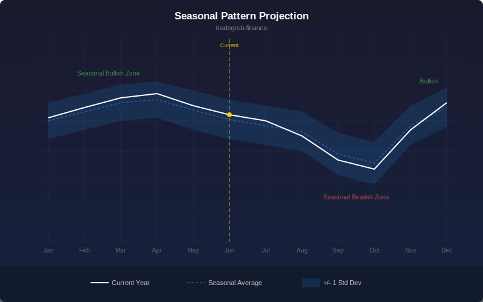

# Seasonal Pattern Projection

Computes average historical returns at the same relative position within a rolling cycle to project expected seasonal direction.

## Conceptual Diagram

## Parameters

| Parameter      | Type | Default | Range    | Description                               |
|----------------|------|---------|----------|-------------------------------------------|
| Cycle Length    | int  | 252     | 20-1000  | Bars per cycle (252 approximates one year) |
| Number of Cycles | int  | 5       | 2-20     | How many past cycles to average            |

## Signals

- **Seasonal Score (blue):** Smoothed average return at the current cycle position, scaled for visibility
- **Consistency (orange):** Ratio of average return to standard deviation across cycles, higher means more reliable
- **Green background:** Positive seasonal bias
- **Red background:** Negative seasonal bias

## Usage

Positive seasonal scores suggest historically bullish periods at this point in the cycle. High consistency values indicate the seasonal pattern has been reliable across multiple cycles. Use as a filter to align trades with seasonal tendencies. The default 252-bar cycle approximates annual seasonality on daily charts. Adjust cycle length for intraday or weekly timeframes.
