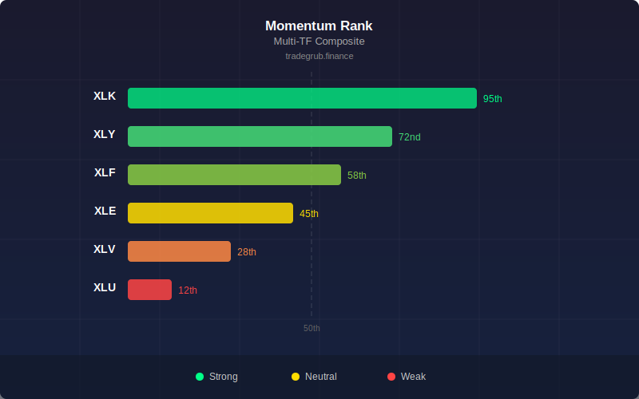

# Momentum Rank

Ranks the current symbol's momentum across 5 timeframes (5, 10, 20, 50, 100 bars) as a weighted composite percentile score from 0 to 100.

## How It Works

- Computes returns over 5 different periods (5, 10, 20, 50, 100 bars)
- Ranks each return as a percentile against its own lookback history
- Combines percentile ranks using weights that favor shorter periods
- Outputs a composite score: 0 = weakest momentum, 100 = strongest

## Parameters

| Parameter | Default | Range | Description |
|-----------|---------|-------|-------------|
| Lookback  | 200     | 50-500 | Historical window for percentile ranking |

## Signals

- **Above 80**: Strong upward momentum (green background)
- **Below 20**: Strong downward momentum (red background)
- **Around 50**: Neutral momentum
- Green line when above 50, red when below

## Usage Notes

- Higher lookback gives more stable rankings but slower to react
- Readings above 80 can indicate either strong trend or overextension
- Crossings of 50 line often align with trend direction changes
